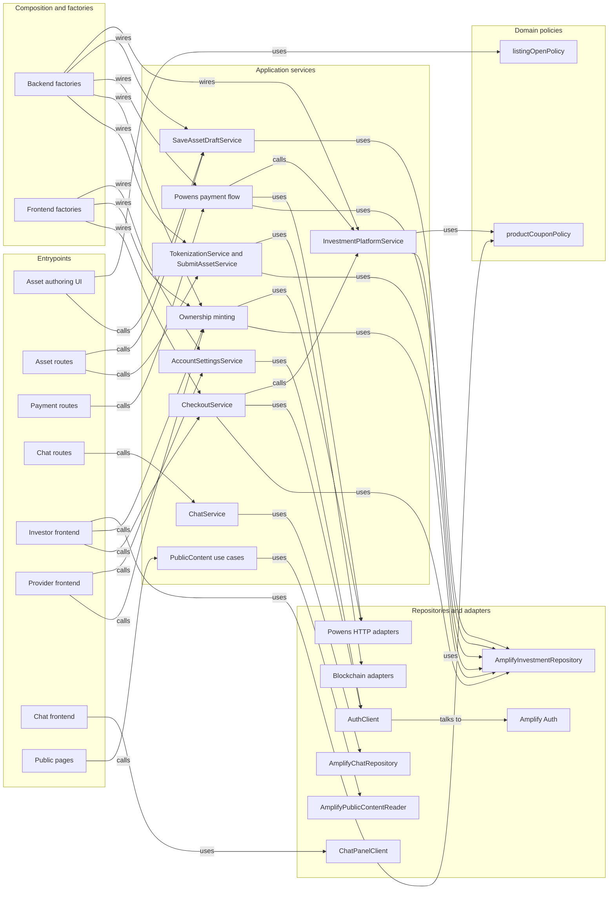

## Simplified overview

```mermaid
flowchart LR
  subgraph Entry["Entrypoints"]
    E0["Asset authoring UI"]
    E1["Asset routes"]
    E2["Payment routes"]
    E3["Chat routes"]
    E4["Investor frontend"]
    E5["Provider frontend"]
    E6["Chat frontend"]
    E7["Public pages"]
  end

  subgraph App["Application services"]
    A1["TokenizationService and SubmitAssetService"]
    A2["Ownership minting"]
    A3["Powens payment flow"]
    A4["ChatService"]
    A5["CheckoutService"]
    A6["AccountSettingsService"]
    A7["SaveAssetDraftService"]
    A8["PublicContent use cases"]
    A9["InvestmentPlatformService"]
  end

  subgraph Domain["Domain policies"]
    D1["listingOpenPolicy"]
    D2["productCouponPolicy"]
  end

  subgraph Infra["Repositories and adapters"]
    I1["AmplifyInvestmentRepository"]
    I2["AmplifyChatRepository"]
    I3["AmplifyPublicContentReader"]
    I4["AuthClient"]
    I5["Blockchain adapters"]
    I6["Powens HTTP adapters"]
    I7["ChatPanelClient"]
    I8["Amplify Auth"]
  end

  subgraph Wiring["Composition and factories"]
    W1["Backend factories"]
    W2["Frontend factories"]
  end

  E0 -->|calls| A7
  E1 -->|calls| A1
  E1 -->|calls| A7
  E2 -->|calls| A3
  E3 -->|calls| A4
  E4 -->|calls| A5
  E4 -->|calls| A2
  E5 -->|calls| A2
  E5 -->|calls| A6
  E6 -->|uses| I7
  E7 -->|calls| A8

  A1 -->|uses| I1
  A1 -->|uses| I5
  A2 -->|uses| I1
  A2 -->|uses| I6
  A3 -->|uses| I1
  A3 -->|uses| I6
  A3 -->|calls| A9
  A4 -->|uses| I2
  A5 -->|uses| I1
  A5 -->|uses| I4
  A5 -->|calls| A9
  A6 -->|uses| I4
  A7 -->|uses| I1
  A8 -->|uses| I3
  A9 -->|uses| I1
  A9 -->|uses| D2
  I4 -->|talks to| I8

  E0 -->|uses| D1
  E4 -->|uses| D2

  W1 -->|wires| A1
  W1 -->|wires| A2
  W1 -->|wires| A3
  W1 -->|wires| A7
  W1 -->|wires| A9
  W2 -->|wires| A5
  W2 -->|wires| A2
  W2 -->|wires| A6
```
