# Use cases sequence

## InvestmentPlatformService.createAsset

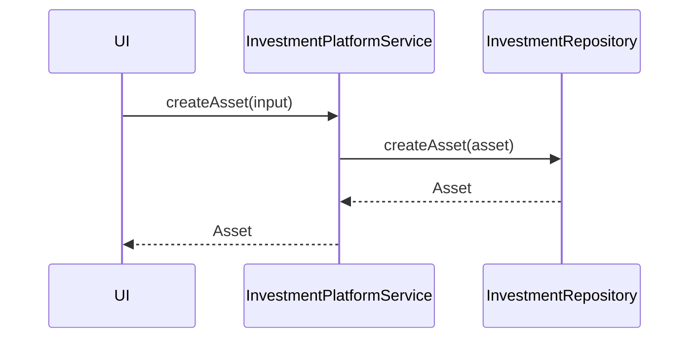
```mermaid
sequenceDiagram
  participant UI
  participant InvestmentPlatformService
  participant InvestmentRepository

  UI->>InvestmentPlatformService: createAsset(input)
  InvestmentPlatformService->>InvestmentRepository: createAsset(asset)
  InvestmentRepository-->>InvestmentPlatformService: Asset
  InvestmentPlatformService-->>UI: Asset
```

## AssetSubmissionFlow.submitAsset

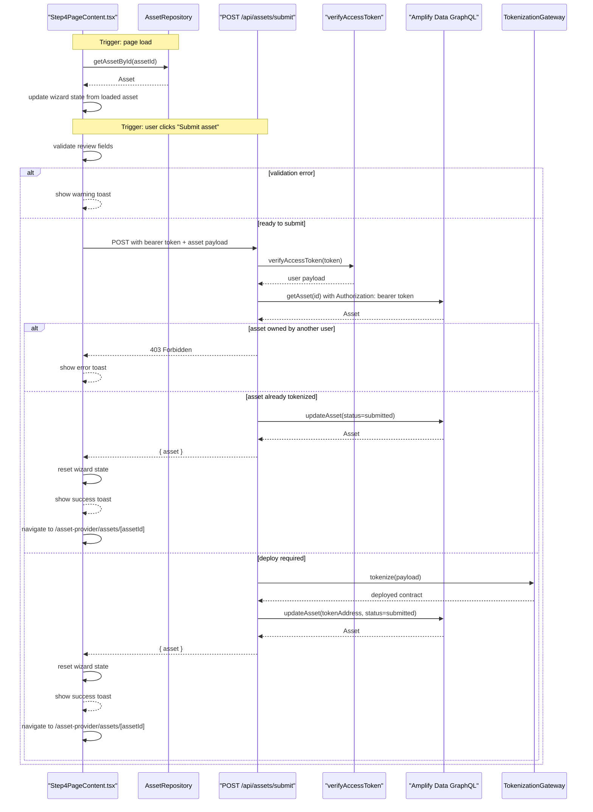
```mermaid
sequenceDiagram
  participant Step4Page as "Step4PageContent.tsx"
  participant AssetRepository
  participant SubmitAssetAPI as "POST /api/assets/submit"
  participant VerifyToken as "verifyAccessToken"
  participant AppSyncGraphQL as "Amplify Data GraphQL"
  participant TokenizationGateway

  Note over Step4Page,AssetRepository: Trigger: page load
  Step4Page->>AssetRepository: getAssetById(assetId)
  AssetRepository-->>Step4Page: Asset
  Step4Page->>Step4Page: update wizard state from loaded asset

  Note over Step4Page,SubmitAssetAPI: Trigger: user clicks "Submit asset"
  Step4Page->>Step4Page: validate review fields
  alt validation error
    Step4Page-->>Step4Page: show warning toast
  else ready to submit
    Step4Page->>SubmitAssetAPI: POST with bearer token + asset payload
    SubmitAssetAPI->>VerifyToken: verifyAccessToken(token)
    VerifyToken-->>SubmitAssetAPI: user payload
    SubmitAssetAPI->>AppSyncGraphQL: getAsset(id) with Authorization: bearer token
    AppSyncGraphQL-->>SubmitAssetAPI: Asset
    alt asset owned by another user
      SubmitAssetAPI-->>Step4Page: 403 Forbidden
      Step4Page-->>Step4Page: show error toast
    else asset already tokenized
      SubmitAssetAPI->>AppSyncGraphQL: updateAsset(status=submitted)
      AppSyncGraphQL-->>SubmitAssetAPI: Asset
      SubmitAssetAPI-->>Step4Page: { asset }
      Step4Page->>Step4Page: reset wizard state
      Step4Page-->>Step4Page: show success toast
      Step4Page->>Step4Page: navigate to /asset-provider/assets/[assetId]
    else deploy required
      SubmitAssetAPI->>TokenizationGateway: tokenize(payload)
      TokenizationGateway-->>SubmitAssetAPI: deployed contract
      SubmitAssetAPI->>AppSyncGraphQL: updateAsset(tokenAddress, status=submitted)
      AppSyncGraphQL-->>SubmitAssetAPI: Asset
      SubmitAssetAPI-->>Step4Page: { asset }
      Step4Page->>Step4Page: reset wizard state
      Step4Page-->>Step4Page: show success toast
      Step4Page->>Step4Page: navigate to /asset-provider/assets/[assetId]
    end
  end
```

## InvestmentPlatformService.createListing

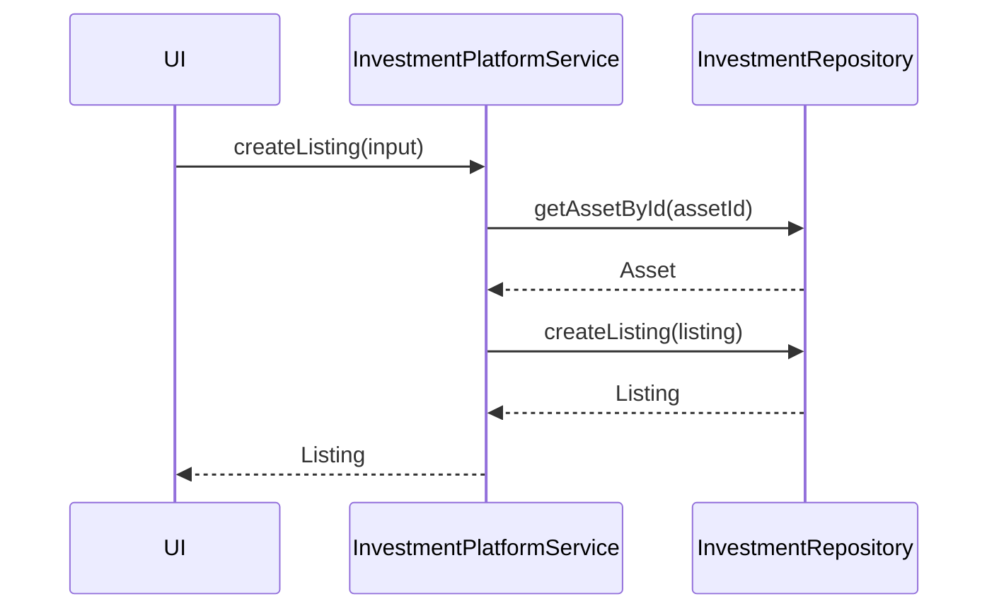
```mermaid
sequenceDiagram
  participant UI
  participant InvestmentPlatformService
  participant InvestmentRepository

  UI->>InvestmentPlatformService: createListing(input)
  InvestmentPlatformService->>InvestmentRepository: getAssetById(assetId)
  InvestmentRepository-->>InvestmentPlatformService: Asset
  InvestmentPlatformService->>InvestmentRepository: createListing(listing)
  InvestmentRepository-->>InvestmentPlatformService: Listing
  InvestmentPlatformService-->>UI: Listing
```

## InvestmentPlatformService.saveListing

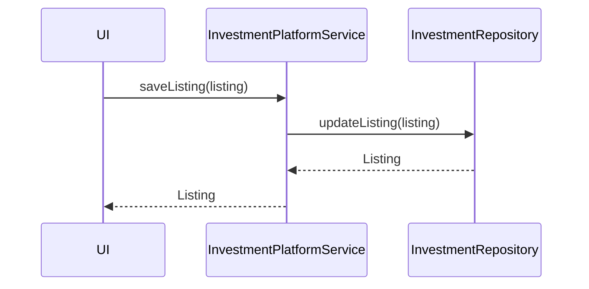
```mermaid
sequenceDiagram
  participant UI
  participant InvestmentPlatformService
  participant InvestmentRepository

  UI->>InvestmentPlatformService: saveListing(listing)
  InvestmentPlatformService->>InvestmentRepository: updateListing(listing)
  InvestmentRepository-->>InvestmentPlatformService: Listing
  InvestmentPlatformService-->>UI: Listing
```

## InvestmentPlatformService.createProduct

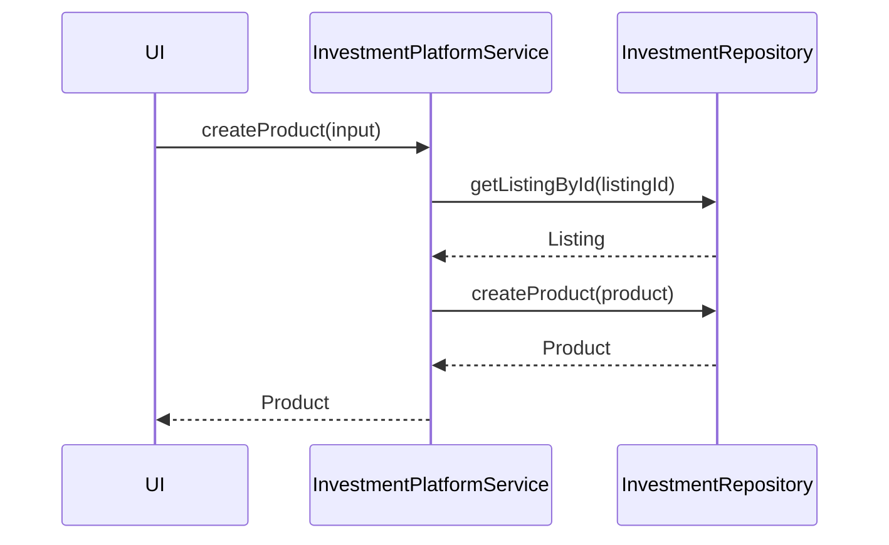
```mermaid
sequenceDiagram
  participant UI
  participant InvestmentPlatformService
  participant InvestmentRepository

  UI->>InvestmentPlatformService: createProduct(input)
  InvestmentPlatformService->>InvestmentRepository: getListingById(listingId)
  InvestmentRepository-->>InvestmentPlatformService: Listing
  InvestmentPlatformService->>InvestmentRepository: createProduct(product)
  InvestmentRepository-->>InvestmentPlatformService: Product
  InvestmentPlatformService-->>UI: Product
```

## InvestmentPlatformService.saveProduct

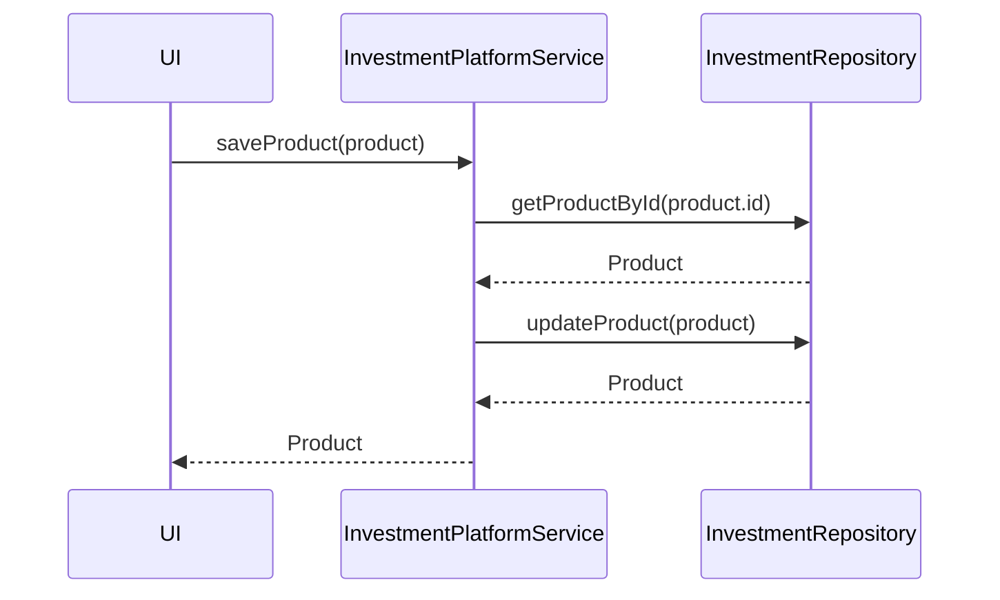
```mermaid
sequenceDiagram
  participant UI
  participant InvestmentPlatformService
  participant InvestmentRepository

  UI->>InvestmentPlatformService: saveProduct(product)
  InvestmentPlatformService->>InvestmentRepository: getProductById(product.id)
  InvestmentRepository-->>InvestmentPlatformService: Product
  InvestmentPlatformService->>InvestmentRepository: updateProduct(product)
  InvestmentRepository-->>InvestmentPlatformService: Product
  InvestmentPlatformService-->>UI: Product
```

## InvestmentPlatformService.completeOrderPayment

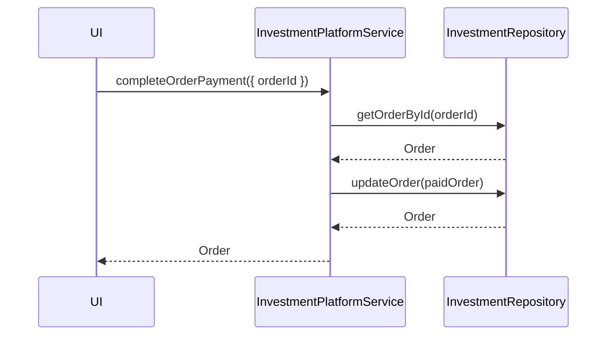
```mermaid
sequenceDiagram
  participant UI
  participant InvestmentPlatformService
  participant InvestmentRepository

  UI->>InvestmentPlatformService: completeOrderPayment({ orderId })
  InvestmentPlatformService->>InvestmentRepository: getOrderById(orderId)
  InvestmentRepository-->>InvestmentPlatformService: Order
  InvestmentPlatformService->>InvestmentRepository: updateOrder(paidOrder)
  InvestmentRepository-->>InvestmentPlatformService: Order
  InvestmentPlatformService-->>UI: Order
```

## CheckoutService.loadCheckout

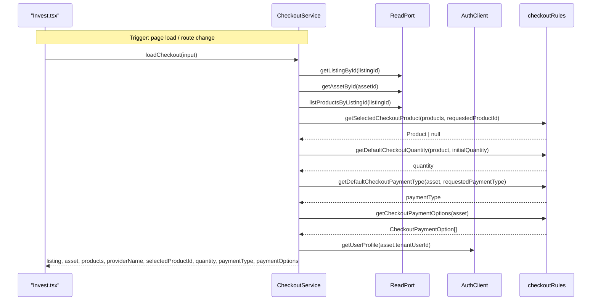
```mermaid
sequenceDiagram
  participant InvestPage as "Invest.tsx"
  participant CheckoutService
  participant ReadPort
  participant AuthClient
  participant checkoutRules

  Note over InvestPage,CheckoutService: Trigger: page load / route change
  InvestPage->>CheckoutService: loadCheckout(input)
  CheckoutService->>ReadPort: getListingById(listingId)
  CheckoutService->>ReadPort: getAssetById(assetId)
  CheckoutService->>ReadPort: listProductsByListingId(listingId)
  CheckoutService->>checkoutRules: getSelectedCheckoutProduct(products, requestedProductId)
  checkoutRules-->>CheckoutService: Product | null
  CheckoutService->>checkoutRules: getDefaultCheckoutQuantity(product, initialQuantity)
  checkoutRules-->>CheckoutService: quantity
  CheckoutService->>checkoutRules: getDefaultCheckoutPaymentType(asset, requestedPaymentType)
  checkoutRules-->>CheckoutService: paymentType
  CheckoutService->>checkoutRules: getCheckoutPaymentOptions(asset)
  checkoutRules-->>CheckoutService: CheckoutPaymentOption[]
  CheckoutService->>AuthClient: getUserProfile(asset.tenantUserId)
  CheckoutService-->>InvestPage: listing, asset, products, providerName, selectedProductId, quantity, paymentType, paymentOptions
```

## Checkout End-to-End

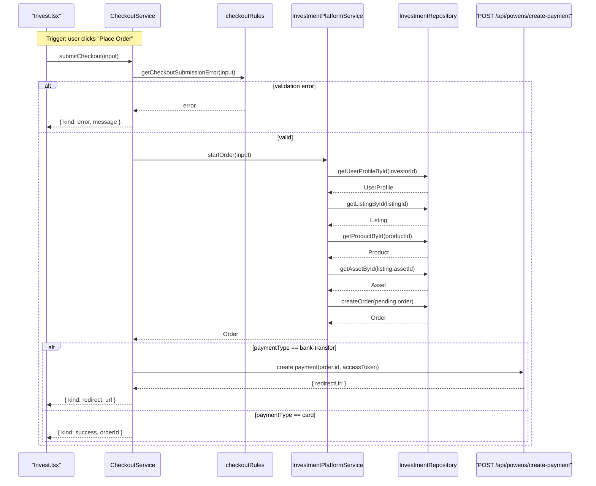
```mermaid
sequenceDiagram
  participant InvestPage as "Invest.tsx"
  participant CheckoutService
  participant checkoutRules
  participant InvestmentPlatformService
  participant InvestmentRepository
  participant PowensAPI as "POST /api/powens/create-payment"

  Note over InvestPage,CheckoutService: Trigger: user clicks "Place Order"
  InvestPage->>CheckoutService: submitCheckout(input)
  CheckoutService->>checkoutRules: getCheckoutSubmissionError(input)
  alt validation error
    checkoutRules-->>CheckoutService: error
    CheckoutService-->>InvestPage: { kind: error, message }
  else valid
    CheckoutService->>InvestmentPlatformService: startOrder(input)
    InvestmentPlatformService->>InvestmentRepository: getUserProfileById(investorId)
    InvestmentRepository-->>InvestmentPlatformService: UserProfile
    InvestmentPlatformService->>InvestmentRepository: getListingById(listingId)
    InvestmentRepository-->>InvestmentPlatformService: Listing
    InvestmentPlatformService->>InvestmentRepository: getProductById(productId)
    InvestmentRepository-->>InvestmentPlatformService: Product
    InvestmentPlatformService->>InvestmentRepository: getAssetById(listing.assetId)
    InvestmentRepository-->>InvestmentPlatformService: Asset
    InvestmentPlatformService->>InvestmentRepository: createOrder(pending order)
    InvestmentRepository-->>InvestmentPlatformService: Order
    InvestmentPlatformService-->>CheckoutService: Order
    alt paymentType == bank-transfer
      CheckoutService->>PowensAPI: create payment(order.id, accessToken)
      PowensAPI-->>CheckoutService: { redirectUrl }
      CheckoutService-->>InvestPage: { kind: redirect, url }
    else paymentType == card
      CheckoutService-->>InvestPage: { kind: success, orderId }
    end
  end
```

## POST /api/powens/create-payment

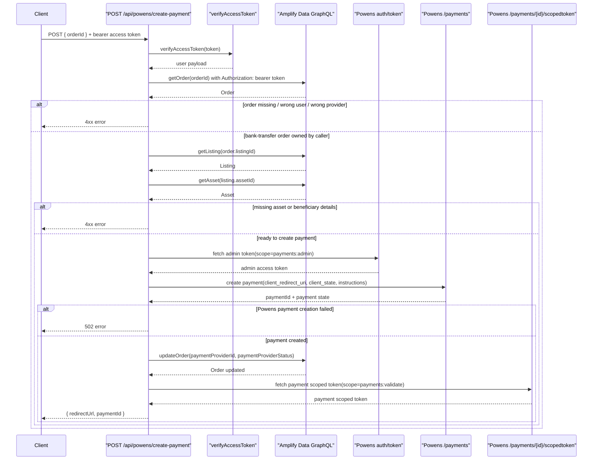
```mermaid
sequenceDiagram
  participant Client
  participant CreatePaymentAPI as "POST /api/powens/create-payment"
  participant VerifyToken as "verifyAccessToken"
  participant AppSyncGraphQL as "Amplify Data GraphQL"
  participant PowensAuth as "Powens auth/token"
  participant PowensPayments as "Powens /payments"
  participant PowensScopedToken as "Powens /payments/{id}/scopedtoken"

  Client->>CreatePaymentAPI: POST { orderId } + bearer access token
  CreatePaymentAPI->>VerifyToken: verifyAccessToken(token)
  VerifyToken-->>CreatePaymentAPI: user payload

  CreatePaymentAPI->>AppSyncGraphQL: getOrder(orderId) with Authorization: bearer token
  AppSyncGraphQL-->>CreatePaymentAPI: Order
  alt order missing / wrong user / wrong provider
    CreatePaymentAPI-->>Client: 4xx error
  else bank-transfer order owned by caller
    CreatePaymentAPI->>AppSyncGraphQL: getListing(order.listingId)
    AppSyncGraphQL-->>CreatePaymentAPI: Listing
    CreatePaymentAPI->>AppSyncGraphQL: getAsset(listing.assetId)
    AppSyncGraphQL-->>CreatePaymentAPI: Asset
    alt missing asset or beneficiary details
      CreatePaymentAPI-->>Client: 4xx error
    else ready to create payment
      CreatePaymentAPI->>PowensAuth: fetch admin token(scope=payments:admin)
      PowensAuth-->>CreatePaymentAPI: admin access token
      CreatePaymentAPI->>PowensPayments: create payment(client_redirect_uri, client_state, instructions)
      PowensPayments-->>CreatePaymentAPI: paymentId + payment state
      alt Powens payment creation failed
        CreatePaymentAPI-->>Client: 502 error
      else payment created
        CreatePaymentAPI->>AppSyncGraphQL: updateOrder(paymentProviderId, paymentProviderStatus)
        AppSyncGraphQL-->>CreatePaymentAPI: Order updated
        CreatePaymentAPI->>PowensScopedToken: fetch payment scoped token(scope=payments:validate)
        PowensScopedToken-->>CreatePaymentAPI: payment scoped token
        CreatePaymentAPI-->>Client: { redirectUrl, paymentId }
      end
    end
  end
```

## OwnershipMintingService.mint

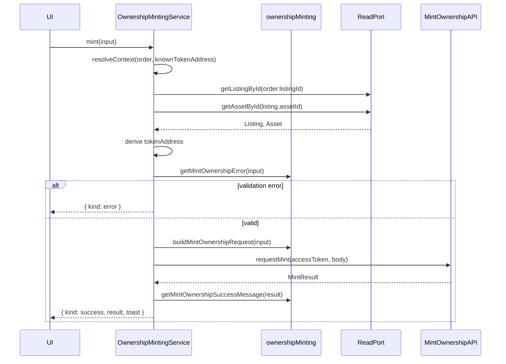
```mermaid
sequenceDiagram
  participant UI
  participant OwnershipMintingService
  participant ownershipMinting
  participant ReadPort
  participant MintOwnershipAPI

  UI->>OwnershipMintingService: mint(input)
  OwnershipMintingService->>OwnershipMintingService: resolveContext(order, knownTokenAddress)
  OwnershipMintingService->>ReadPort: getListingById(order.listingId)
  OwnershipMintingService->>ReadPort: getAssetById(listing.assetId)
  ReadPort-->>OwnershipMintingService: Listing, Asset
  OwnershipMintingService->>OwnershipMintingService: derive tokenAddress
  OwnershipMintingService->>ownershipMinting: getMintOwnershipError(input)
  alt validation error
    OwnershipMintingService-->>UI: { kind: error }
  else valid
    OwnershipMintingService->>ownershipMinting: buildMintOwnershipRequest(input)
    OwnershipMintingService->>MintOwnershipAPI: requestMint(accessToken, body)
    MintOwnershipAPI-->>OwnershipMintingService: MintResult
    OwnershipMintingService->>ownershipMinting: getMintOwnershipSuccessMessage(result)
    OwnershipMintingService-->>UI: { kind: success, result, toast }
  end
```

## POST /api/mint-ownership

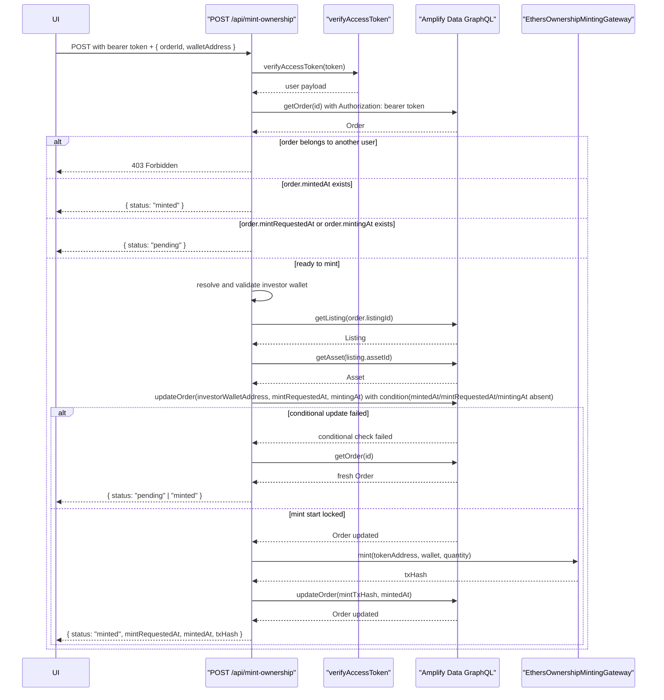
```mermaid
sequenceDiagram
  participant UI
  participant MintOwnershipAPI as "POST /api/mint-ownership"
  participant VerifyToken as "verifyAccessToken"
  participant AppSyncGraphQL as "Amplify Data GraphQL"
  participant MintGateway as "EthersOwnershipMintingGateway"

  UI->>MintOwnershipAPI: POST with bearer token + { orderId, walletAddress }
  MintOwnershipAPI->>VerifyToken: verifyAccessToken(token)
  VerifyToken-->>MintOwnershipAPI: user payload
  MintOwnershipAPI->>AppSyncGraphQL: getOrder(id) with Authorization: bearer token
  AppSyncGraphQL-->>MintOwnershipAPI: Order
  alt order belongs to another user
    MintOwnershipAPI-->>UI: 403 Forbidden
  else order.mintedAt exists
    MintOwnershipAPI-->>UI: { status: "minted" }
  else order.mintRequestedAt or order.mintingAt exists
    MintOwnershipAPI-->>UI: { status: "pending" }
  else ready to mint
    MintOwnershipAPI->>MintOwnershipAPI: resolve and validate investor wallet
    MintOwnershipAPI->>AppSyncGraphQL: getListing(order.listingId)
    AppSyncGraphQL-->>MintOwnershipAPI: Listing
    MintOwnershipAPI->>AppSyncGraphQL: getAsset(listing.assetId)
    AppSyncGraphQL-->>MintOwnershipAPI: Asset
    MintOwnershipAPI->>AppSyncGraphQL: updateOrder(investorWalletAddress, mintRequestedAt, mintingAt) with condition(mintedAt/mintRequestedAt/mintingAt absent)
    alt conditional update failed
      AppSyncGraphQL-->>MintOwnershipAPI: conditional check failed
      MintOwnershipAPI->>AppSyncGraphQL: getOrder(id)
      AppSyncGraphQL-->>MintOwnershipAPI: fresh Order
      MintOwnershipAPI-->>UI: { status: "pending" | "minted" }
    else mint start locked
      AppSyncGraphQL-->>MintOwnershipAPI: Order updated
      MintOwnershipAPI->>MintGateway: mint(tokenAddress, wallet, quantity)
      MintGateway-->>MintOwnershipAPI: txHash
      MintOwnershipAPI->>AppSyncGraphQL: updateOrder(mintTxHash, mintedAt)
      AppSyncGraphQL-->>MintOwnershipAPI: Order updated
      MintOwnershipAPI-->>UI: { status: "minted", mintRequestedAt, mintedAt, txHash }
    end
  end
```

## PowensPaymentSync.pullFromCallbackUi

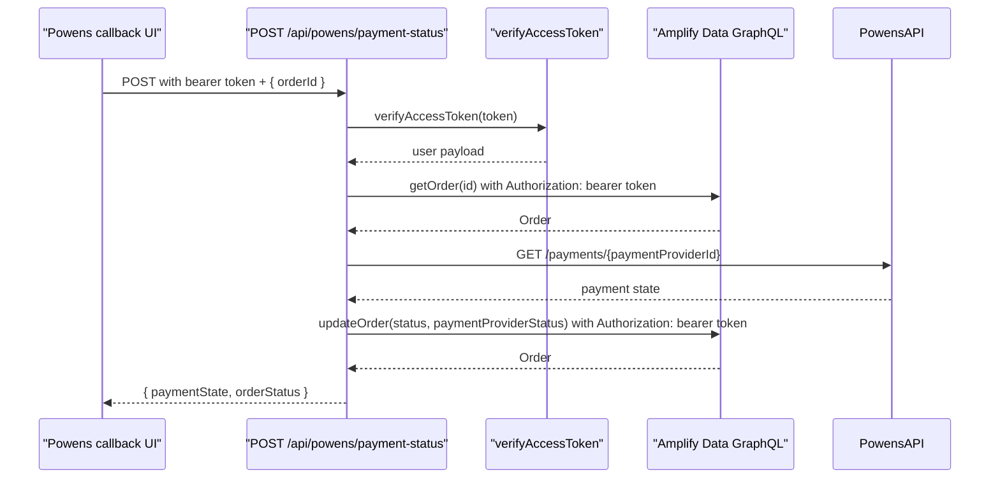
```mermaid
sequenceDiagram
  participant CallbackPage as "Powens callback UI"
  participant PaymentStatusAPI as "POST /api/powens/payment-status"
  participant VerifyToken as "verifyAccessToken"
  participant AppSyncGraphQL as "Amplify Data GraphQL"
  participant PowensAPI

  CallbackPage->>PaymentStatusAPI: POST with bearer token + { orderId }
  PaymentStatusAPI->>VerifyToken: verifyAccessToken(token)
  VerifyToken-->>PaymentStatusAPI: user payload
  PaymentStatusAPI->>AppSyncGraphQL: getOrder(id) with Authorization: bearer token
  AppSyncGraphQL-->>PaymentStatusAPI: Order
  PaymentStatusAPI->>PowensAPI: GET /payments/{paymentProviderId}
  PowensAPI-->>PaymentStatusAPI: payment state
  PaymentStatusAPI->>AppSyncGraphQL: updateOrder(status, paymentProviderStatus) with Authorization: bearer token
  AppSyncGraphQL-->>PaymentStatusAPI: Order
  PaymentStatusAPI-->>CallbackPage: { paymentState, orderStatus }
```

## PowensPaymentSync.pushFromPowensWebhook

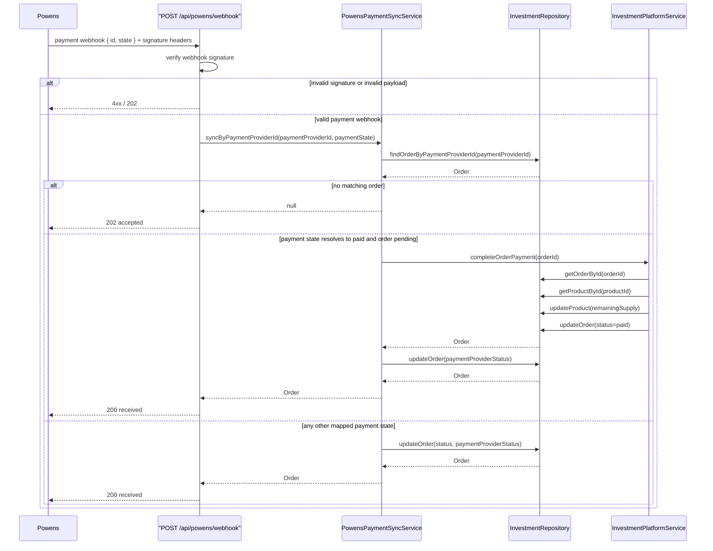
```mermaid
sequenceDiagram
  participant Powens
  participant WebhookAPI as "POST /api/powens/webhook"
  participant PowensPaymentSyncService
  participant InvestmentRepository
  participant InvestmentPlatformService

  Powens->>WebhookAPI: payment webhook { id, state } + signature headers
  WebhookAPI->>WebhookAPI: verify webhook signature
  alt invalid signature or invalid payload
    WebhookAPI-->>Powens: 4xx / 202
  else valid payment webhook
    WebhookAPI->>PowensPaymentSyncService: syncByPaymentProviderId(paymentProviderId, paymentState)
    PowensPaymentSyncService->>InvestmentRepository: findOrderByPaymentProviderId(paymentProviderId)
    InvestmentRepository-->>PowensPaymentSyncService: Order
    alt no matching order
      PowensPaymentSyncService-->>WebhookAPI: null
      WebhookAPI-->>Powens: 202 accepted
    else payment state resolves to paid and order pending
      PowensPaymentSyncService->>InvestmentPlatformService: completeOrderPayment(orderId)
      InvestmentPlatformService->>InvestmentRepository: getOrderById(orderId)
      InvestmentPlatformService->>InvestmentRepository: getProductById(productId)
      InvestmentPlatformService->>InvestmentRepository: updateProduct(remainingSupply)
      InvestmentPlatformService->>InvestmentRepository: updateOrder(status=paid)
      InvestmentRepository-->>PowensPaymentSyncService: Order
      PowensPaymentSyncService->>InvestmentRepository: updateOrder(paymentProviderStatus)
      InvestmentRepository-->>PowensPaymentSyncService: Order
      PowensPaymentSyncService-->>WebhookAPI: Order
      WebhookAPI-->>Powens: 200 received
    else any other mapped payment state
      PowensPaymentSyncService->>InvestmentRepository: updateOrder(status, paymentProviderStatus)
      InvestmentRepository-->>PowensPaymentSyncService: Order
      PowensPaymentSyncService-->>WebhookAPI: Order
      WebhookAPI-->>Powens: 200 received
    end
  end
```

## AccountSettingsService.saveProviderSettings

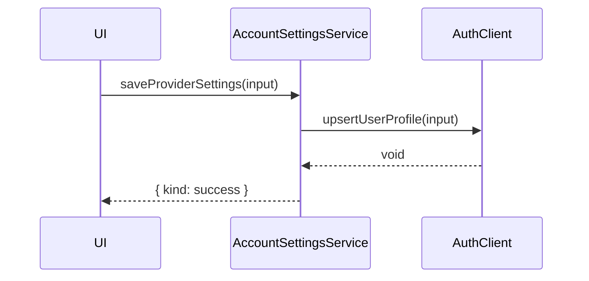
```mermaid
sequenceDiagram
  participant UI
  participant AccountSettingsService
  participant AuthClient

  UI->>AccountSettingsService: saveProviderSettings(input)
  AccountSettingsService->>AuthClient: upsertUserProfile(input)
  AuthClient-->>AccountSettingsService: void
  AccountSettingsService-->>UI: { kind: success }
```

## AccountSettingsService.saveInvestorSettings

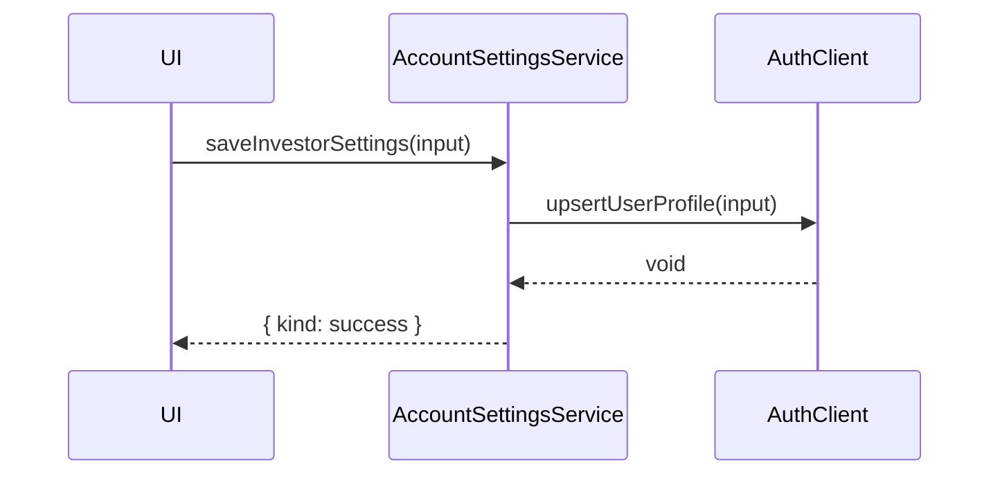
```mermaid
sequenceDiagram
  participant UI
  participant AccountSettingsService
  participant AuthClient

  UI->>AccountSettingsService: saveInvestorSettings(input)
  AccountSettingsService->>AuthClient: upsertUserProfile(input)
  AuthClient-->>AccountSettingsService: void
  AccountSettingsService-->>UI: { kind: success }
```

## AccountSettingsService.deleteAccount

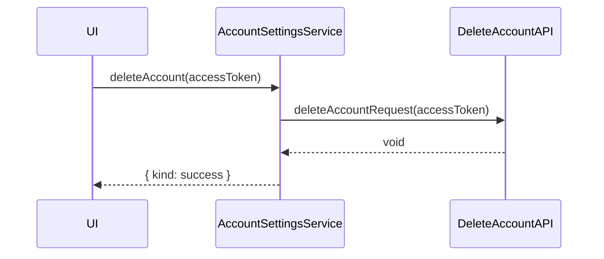
```mermaid
sequenceDiagram
  participant UI
  participant AccountSettingsService
  participant DeleteAccountAPI

  UI->>AccountSettingsService: deleteAccount(accessToken)
  AccountSettingsService->>DeleteAccountAPI: deleteAccountRequest(accessToken)
  DeleteAccountAPI-->>AccountSettingsService: void
  AccountSettingsService-->>UI: { kind: success }
```

## BlogPostAdminService.loadPosts

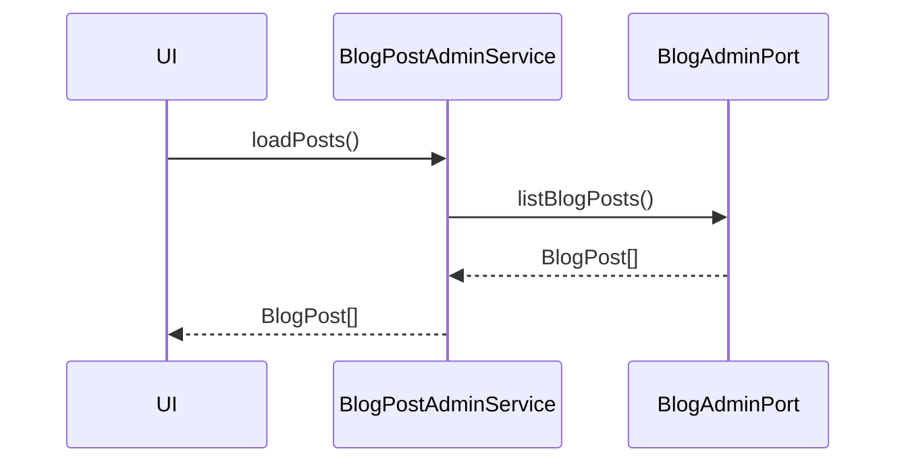
```mermaid
sequenceDiagram
  participant UI
  participant BlogPostAdminService
  participant BlogAdminPort

  UI->>BlogPostAdminService: loadPosts()
  BlogPostAdminService->>BlogAdminPort: listBlogPosts()
  BlogAdminPort-->>BlogPostAdminService: BlogPost[]
  BlogPostAdminService-->>UI: BlogPost[]
```

## BlogPostAdminService.validate

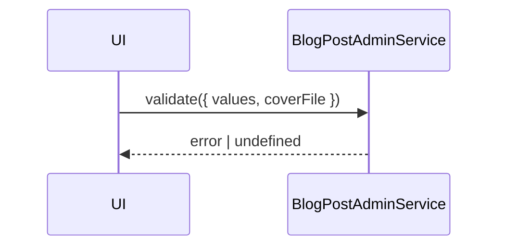
```mermaid
sequenceDiagram
  participant UI
  participant BlogPostAdminService

  UI->>BlogPostAdminService: validate({ values, coverFile })
  BlogPostAdminService-->>UI: error | undefined
```

## BlogPostAdminService.save

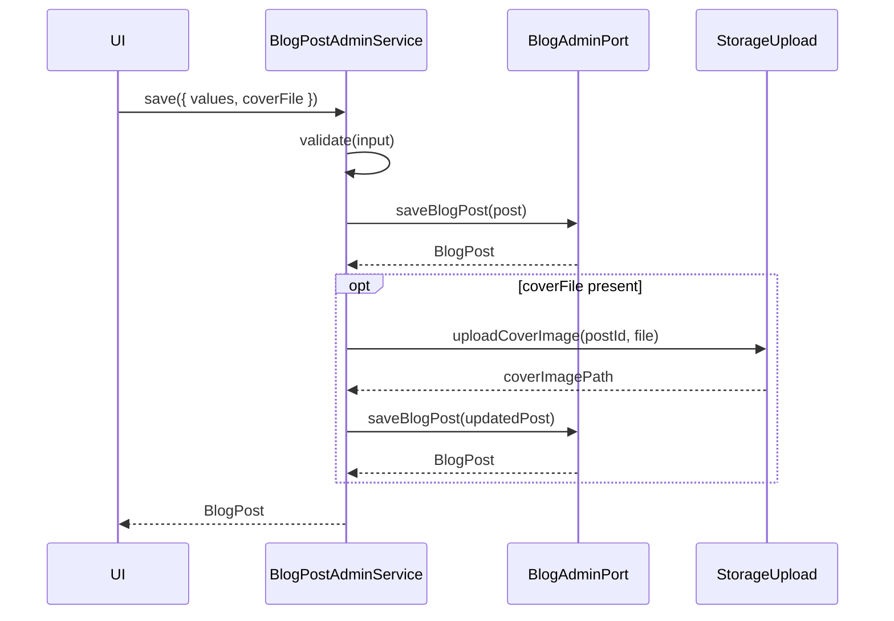
```mermaid
sequenceDiagram
  participant UI
  participant BlogPostAdminService
  participant BlogAdminPort
  participant StorageUpload

  UI->>BlogPostAdminService: save({ values, coverFile })
  BlogPostAdminService->>BlogPostAdminService: validate(input)
  BlogPostAdminService->>BlogAdminPort: saveBlogPost(post)
  BlogAdminPort-->>BlogPostAdminService: BlogPost
  opt coverFile present
    BlogPostAdminService->>StorageUpload: uploadCoverImage(postId, file)
    StorageUpload-->>BlogPostAdminService: coverImagePath
    BlogPostAdminService->>BlogAdminPort: saveBlogPost(updatedPost)
    BlogAdminPort-->>BlogPostAdminService: BlogPost
  end
  BlogPostAdminService-->>UI: BlogPost
```

## BlogPostAdminService.delete

```mermaid
sequenceDiagram
  participant UI
  participant BlogPostAdminService
  participant BlogAdminPort

  UI->>BlogPostAdminService: delete(postId)
  BlogPostAdminService->>BlogAdminPort: deleteBlogPost(postId)
  BlogAdminPort-->>BlogPostAdminService: void
  BlogPostAdminService-->>UI: void
```

## publicContent.listPublicListings

```mermaid
sequenceDiagram
  participant UI
  participant publicContent
  participant PublicContentReader

  UI->>publicContent: listPublicListings()
  publicContent->>PublicContentReader: listPublicListings()
  PublicContentReader-->>publicContent: PublicListingWithAsset[]
  publicContent-->>UI: PublicListingWithAsset[]
```

## publicContent.getPublicListingDetails

```mermaid
sequenceDiagram
  participant UI
  participant publicContent
  participant PublicContentReader

  UI->>publicContent: getPublicListingDetails(listingId)
  publicContent->>PublicContentReader: getPublicListingById(listingId)
  publicContent->>PublicContentReader: listProductsByListingId(listingId)
  PublicContentReader-->>publicContent: listingWithAsset, products
  publicContent-->>UI: listingWithAsset, products
```

## publicContent.listPublicBlogPosts

```mermaid
sequenceDiagram
  participant UI
  participant publicContent
  participant PublicContentReader

  UI->>publicContent: listPublicBlogPosts()
  publicContent->>PublicContentReader: listPublicBlogPosts()
  PublicContentReader-->>publicContent: BlogPost[]
  publicContent-->>UI: BlogPost[]
```

## publicContent.getPublicBlogPost

```mermaid
sequenceDiagram
  participant UI
  participant publicContent
  participant PublicContentReader

  UI->>publicContent: getPublicBlogPost(blogId)
  publicContent->>PublicContentReader: getPublicBlogPost(blogId)
  PublicContentReader-->>publicContent: BlogPost | null
  publicContent-->>UI: BlogPost | null
```

## publicContent.getInvestorOrderEntry

```mermaid
sequenceDiagram
  participant UI
  participant publicContent
  participant PublicContentReader

  UI->>publicContent: getInvestorOrderEntry(orderId)
  publicContent->>PublicContentReader: getOrderById(orderId)
  publicContent->>PublicContentReader: getPublicListingById(order.listingId)
  PublicContentReader-->>publicContent: Order, PublicListingWithAsset
  publicContent-->>UI: order, listingWithAsset
```

## listingOpenRequirements.getListingOpenRequirementError

```mermaid
sequenceDiagram
  participant UI
  participant listingOpenRequirements

  UI->>listingOpenRequirements: getListingOpenRequirementError(listing, asset, products)
  listingOpenRequirements-->>UI: string | undefined
```

## checkoutRules

```mermaid
sequenceDiagram
  participant UI
  participant checkoutRules

  UI->>checkoutRules: getSelectedCheckoutProduct(products, requestedProductId)
  checkoutRules-->>UI: Product | null
  UI->>checkoutRules: getDefaultCheckoutQuantity(product, requestedQuantity)
  checkoutRules-->>UI: string
  UI->>checkoutRules: getCheckoutPaymentOptions(asset)
  checkoutRules-->>UI: CheckoutPaymentOption[]
  UI->>checkoutRules: getDefaultCheckoutPaymentType(asset, requestedPaymentType)
  checkoutRules-->>UI: CheckoutPaymentType
  UI->>checkoutRules: getCheckoutSubmissionError(input)
  checkoutRules-->>UI: error | undefined
```

## ownershipMinting

```mermaid
sequenceDiagram
  participant OwnershipMintingService
  participant ownershipMinting

  OwnershipMintingService->>ownershipMinting: getMintOwnershipError(input)
  OwnershipMintingService->>ownershipMinting: buildMintOwnershipRequest(input)
  OwnershipMintingService->>ownershipMinting: getMintOwnershipSuccessMessage(result)
  ownershipMinting-->>OwnershipMintingService: validation / request body / toast
```

## pricingRules

```mermaid
sequenceDiagram
  participant UI
  participant pricingRules

  UI->>pricingRules: validatePricingState(state)
  pricingRules-->>UI: string | undefined
  UI->>pricingRules: validatePricingTierInput(input)
  pricingRules-->>UI: string | undefined
  UI->>pricingRules: buildPricingTier(input)
  pricingRules-->>UI: PricingTier
```

## assetUpdateAssembler

```mermaid
sequenceDiagram
  participant UI
  participant assetUpdateAssembler

  UI->>assetUpdateAssembler: buildUpdatedAssetBasics(asset, input)
  assetUpdateAssembler-->>UI: Asset
  UI->>assetUpdateAssembler: mergeAssetImagePaths(currentPaths, uploadedPaths)
  assetUpdateAssembler-->>UI: string[]
```
