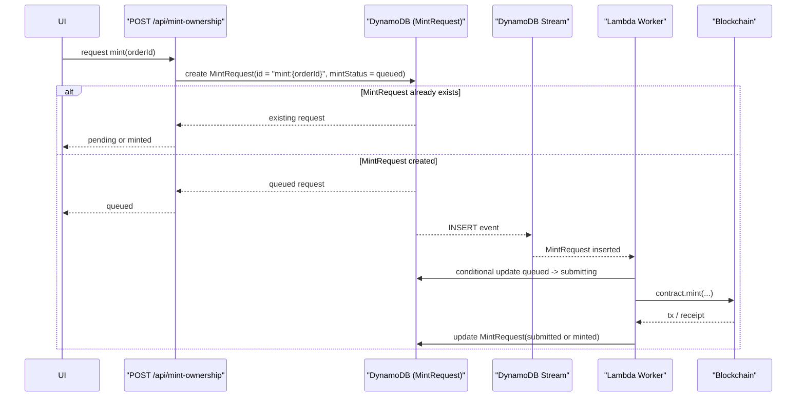
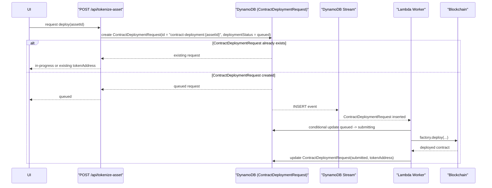

# DynamoDB + Streams (SQS nélkül) – Idempotens request-state flow

## Áttekintés

Ez az architektúra egy event-driven feldolgozási modellt használ SQS nélkül. A DynamoDB tábla tárolja a művelet állapotát, a DynamoDB Stream pedig automatikusan kiváltja a feldolgozást.

```
Client/API
   ↓
DynamoDB (MintRequest / ContractDeploymentRequest)
   ↓
DynamoDB Stream
   ↓
Lambda Worker
   ↓
Blockchain action
   ↓
DynamoDB update
```

A kulcs: minden művelet egy perzisztált állapotgépen keresztül halad.

---

# Adatmodell

## MintRequest tábla

Példa mezők:

```
id
orderId
idempotencyKey
mintStatus
walletAddress
assetId

blockchainTxHash
tokenId

retryCount
errorCode
errorMessage

createdAt
updatedAt
```

## ContractDeploymentRequest tábla

Példa mezők:

```
id
assetId
idempotencyKey
deploymentStatus
runId
tokenStandard
tokenAddress
errorCode
errorMessage
createdAt
updatedAt
```

## Állapotgép

```
queued
 ↓
submitting
 ↓
submitted
 ↓
minted
```

Hiba esetén:

```
submitted
 ↓
failed
```

---

# API Flow

## 1. kliens műveletet kér

Mint:

```
POST /api/mint-ownership
```

Contract deployment:

```
POST /api/tokenize-asset
```

Body:

```
{
  "orderId": "order_123"
}
```

## 2. szerver idempotens rekordot hoz létre

Deterministic request id:

```
mint:{orderId}
contract-deployment:{assetId}
```

Ha rekord már létezik:

* nem hoz létre újat
* visszaadja a meglévő státuszt vagy eredményt

## 3. rekord létrejön

Mint:

```
mintStatus = queued
```

Contract deployment:

```
deploymentStatus = queued
```

Ez **kivált egy DynamoDB Stream eventet**.

---

# DynamoDB Stream

A stream minden `INSERT` vagy `MODIFY` eseményt küld.

Lambda trigger:

```
MintRequest inserted
ContractDeploymentRequest inserted
→ Lambda worker fut
```

---

# Lambda Worker Flow

## 1. claim a rekordot

Atomic update:

Mint:

```
UPDATE MintRequest
SET mintStatus = submitting
WHERE mintStatus = queued
```

Contract deployment:

```
UPDATE ContractDeploymentRequest
SET deploymentStatus = submitting
WHERE deploymentStatus = queued
```

DynamoDB formában:

```
mintStatus = :queued
deploymentStatus = :queued
```

Ha a feltétel nem teljesül:

→ valaki más már feldolgozza.

---

## 2. blockchain tranzakció elküldése / deploy

Mint:

```
const tx = await contract.mint(...)
```

Mentjük a tx hash-t:

```
mintStatus = submitted
blockchainTxHash = tx.hash
```

Contract deployment:

```
const contract = await factory.deploy(...)
```

Mentjük az eredményt:

```
deploymentStatus = submitted
tokenAddress = contract.address
```

---

## 3. confirmation figyelés / véglegesítés

Amikor a transaction megerősített:

```
mintStatus = minted
tokenId = receipt.tokenId
```

Contract deploymentnél a `submitted` állapot már tartalmazza a végeredményt:

```
deploymentStatus = submitted
tokenAddress = deployed.address
```

---

# Idempotencia

## API szinten

Idempotency key biztosítja:

```
mint:{orderId}
contract-deployment:{assetId}
```

Ha a kérés újra érkezik:

* meglévő rekordot adunk vissza
* nem jön létre új request rekord

---

## Worker szinten

Worker csak akkor dolgozik, ha sikerül az állapotváltás:

```
queued → submitting
```

Ez DynamoDB **conditional update**.

Két worker esetén:

```
worker1 → success
worker2 → ConditionalCheckFailed
```

---

# Retry

Hiba esetén:

```
mintStatus = failed
retryCount++
```

Retry logika lehet:

* Lambda retry
* manuális retry

---

# Mermaid sequence-ek

## MintRequest flow



## ContractDeploymentRequest flow



---

# Miért jó ez az architektúra

Előnyök:

* nincs SQS infrastruktúra
* event-driven
* idempotens
* egyszerű
* serverless

---

# Tipikus AWS implementáció

```
DynamoDB
 + Streams
 + Lambda
```

Ez gyakorlatilag egy **beépített queue rendszer**.

Az új rekord automatikusan kivált egy feldolgozást.

---

# Minimális DynamoDB design

Partition key:

```
id
```

GSI:

```
mintStatus
createdAt
```

Így a worker lekérdezheti:

```
mintStatus = queued
```

---

# A legfontosabb szabály

Soha ne így dolgozz:

```
if status == queued
```

Hanem így:

```
UPDATE ... WHERE status = queued
```

Ez biztosítja az **atomikus claimet** és az idempotens feldolgozást.

---

# Rövid összefoglaló

A DynamoDB + Streams modellben:

1. API létrehoz egy `MintRequest` rekordot
2. rekord `queued` státuszban jön létre
3. DynamoDB Stream kivált egy Lambda worker futást
4. worker atomikusan claimeli a rekordot
5. blockchain tranzakció elküldése
6. tx hash mentése
7. confirmation után `minted` státusz

Mindez **SQS nélkül**, tisztán DynamoDB alapokon.
