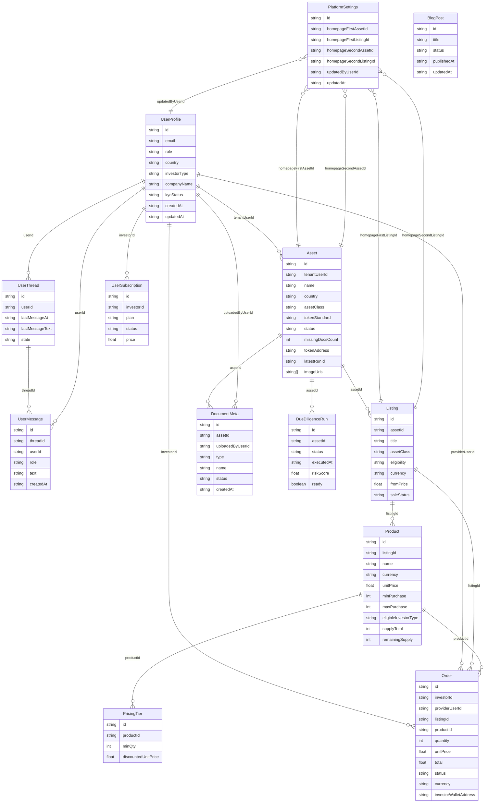

```mermaid
erDiagram
  UserProfile {
    string id
    string email
    string role
    string country
    string investorType
    string companyName
    string kycStatus
    string createdAt
    string updatedAt
  }

  UserThread {
    string id
    string userId
    string lastMessageAt
    string lastMessageText
    string state
  }

  UserMessage {
    string id
    string threadId
    string userId
    string role
    string text
    string createdAt
  }

  Asset {
    string id
    string tenantUserId
    string name
    string country
    string assetClass
    string tokenStandard
    string status
    int missingDocsCount
    string tokenAddress
    string latestRunId
    string[] imageUrls
  }

  Listing {
    string id
    string assetId
    string title
    string assetClass
    string eligibility
    string currency
    float fromPrice
    string saleStatus
  }

  Product {
    string id
    string listingId
    string name
    string currency
    float unitPrice
    int minPurchase
    int maxPurchase
    string eligibleInvestorType
    int supplyTotal
    int remainingSupply
  }

  PricingTier {
    string id
    string productId
    int minQty
    float discountedUnitPrice
  }

  Order {
    string id
    string investorId
    string providerUserId
    string listingId
    string productId
    int quantity
    float unitPrice
    float total
    string status
    string currency
    string investorWalletAddress
  }

  DocumentMeta {
    string id
    string assetId
    string uploadedByUserId
    string type
    string name
    string status
    string createdAt
  }

  DueDiligenceRun {
    string id
    string assetId
    string status
    string executedAt
    float riskScore
    boolean ready
  }

  UserSubscription {
    string id
    string investorId
    string plan
    string status
    float price
  }

  PlatformSettings {
    string id
    string homepageFirstAssetId
    string homepageFirstListingId
    string homepageSecondAssetId
    string homepageSecondListingId
    string updatedByUserId
    string updatedAt
  }

  BlogPost {
    string id
    string title
    string status
    string publishedAt
    string updatedAt
  }

  UserProfile ||--o{ UserThread : "userId"
  UserThread ||--o{ UserMessage : "threadId"
  UserProfile ||--o{ UserMessage : "userId"

  UserProfile ||--o{ Asset : "tenantUserId"
  Asset ||--o{ Listing : "assetId"
  Listing ||--o{ Product : "listingId"
  Product ||--o{ PricingTier : "productId"

  UserProfile ||--o{ Order : "investorId"
  UserProfile ||--o{ Order : "providerUserId"
  Listing ||--o{ Order : "listingId"
  Product ||--o{ Order : "productId"

  Asset ||--o{ DocumentMeta : "assetId"
  UserProfile ||--o{ DocumentMeta : "uploadedByUserId"

  Asset ||--o{ DueDiligenceRun : "assetId"
  UserProfile ||--o{ UserSubscription : "investorId"

  PlatformSettings }o--|| Asset : "homepageFirstAssetId"
  PlatformSettings }o--|| Asset : "homepageSecondAssetId"
  PlatformSettings }o--|| Listing : "homepageFirstListingId"
  PlatformSettings }o--|| Listing : "homepageSecondListingId"
  PlatformSettings }o--|| UserProfile : "updatedByUserId"
```
