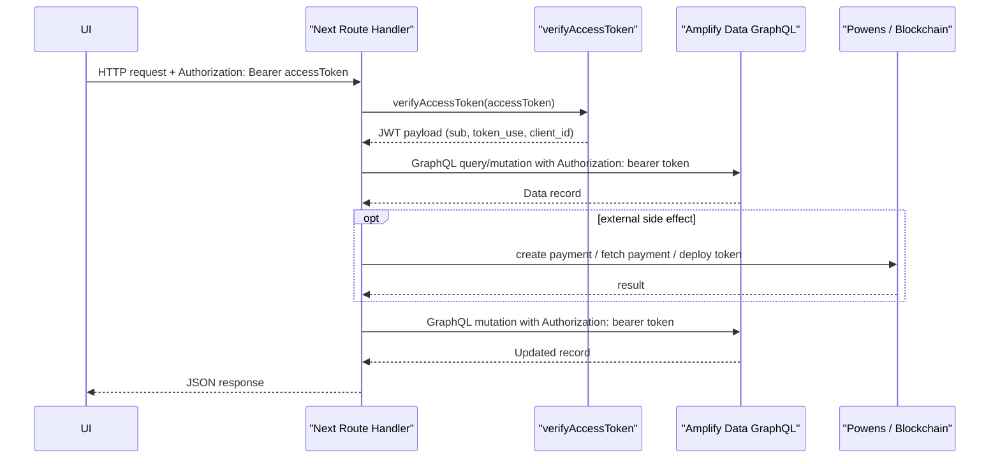

# Bearer JWT Route Auth Summary

## Mi változott

Korábban több server route ezt a mintát használta:

- route megkapta a bearer access tokent
- `verifyAccessToken()` validálta is
- utána a route szerveroldali `generateClient()` / repository hívással próbált Amplify Data műveletet végezni

Ez azért csúszott félre, mert a route-ban validált bearer token nem volt automatikusan összedrótozva az Amplify Data kliens auth kontextusával. Emiatt AppSync oldalon ilyen hibák jelentek meg:

- `NoValidAuthTokens: No federated jwt`
- `Not Authorized to access ... on type Query`
- `Not Authorized to access ... on type Mutation`

A javított minta most ez:

- a route megkapja a bearer access tokent
- `verifyAccessToken()` validálja
- a route explicit GraphQL `fetch`-sel hívja az AppSync endpointot
- az AppSync kérés `Authorization` fejléce ugyanazt a bearer tokent kapja

Ez megszünteti az implicit Amplify szerver auth sessionre épülő bizonytalanságot.

## Érintett endpointok

### `POST /api/assets/submit`

Régi működés:

- token verify
- szerveroldali repository / Amplify Data műveletek implicit auth sessionnel

Új működés:

- token verify
- `getAsset` explicit AppSync GraphQL hívással
- owner check
- szükség esetén token deploy
- `updateAsset` explicit AppSync GraphQL hívással

Megjegyzés:

- az `Asset` modell auth szabálya is igazítva lett a domain owner mezőhöz:
  - `allow.ownerDefinedIn("tenantUserId")`

### `POST /api/powens/create-payment`

Régi működés:

- token verify
- `Order.get`, `Listing.get`, `Asset.get`, `Order.update`
- szerveroldali `generateClient()` implicit authtal

Új működés:

- token verify
- `getOrder`, `getListing`, `getAsset`
- explicit AppSync GraphQL bearer auth-tal
- Powens payment létrehozás
- `updateOrder(paymentProviderId, paymentProviderStatus)`
- explicit AppSync GraphQL bearer auth-tal

### `POST /api/powens/payment-status`

Régi működés:

- token verify
- `Order.get`
- Powens payment state lekérés
- `Order.update`
- szerveroldali `generateClient()` implicit authtal

Új működés:

- token verify
- `getOrder`
- explicit AppSync GraphQL bearer auth-tal
- Powens payment state lekérés
- `updateOrder(status, paymentProviderStatus)`
- explicit AppSync GraphQL bearer auth-tal

### `POST /api/mint-ownership`

Régi működés:

- token verify
- repository + ownership minting processor service
- szerveroldali Amplify Data hívások implicit auth sessionnel

Új működés:

- token verify
- `getOrder`
- explicit AppSync GraphQL bearer auth-tal
- jogosultság és order státusz ellenőrzés
- szükség esetén `investorWalletAddress` mentés
- `mintRequestedAt` queue-zás
- explicit AppSync GraphQL bearer auth-tal

Megjegyzés:

- a route jelenleg queue/minted állapotkezelést végez
- nem a régi szerveroldali teljes minting pipeline-on megy át

## Közös auth minta

## Miért jobb ez

- a route authforrása egyértelmű: a request bearer tokenje
- nincs rejtett szerveroldali Amplify sessionfüggés
- a hibák pontosabban lokalizálhatók
- ugyanaz a JWT megy végig a route authon és az AppSync adathíváson

## Mikor kell mégis backend deploy

Ehhez a route mintához önmagában nem kell Amplify backend redeploy, mert ez app-kód változás.

Backend deploy csak akkor kell, ha ilyenhez nyúlunk:

- `amplify/data/resource.ts`
- `amplify/backend.ts`
- auth/storage/data resource definíciók

Példa:

- az `Asset` auth javítása (`allow.ownerDefinedIn("tenantUserId")`) már backend schema változás volt, ahhoz kellett sandbox redeploy.
