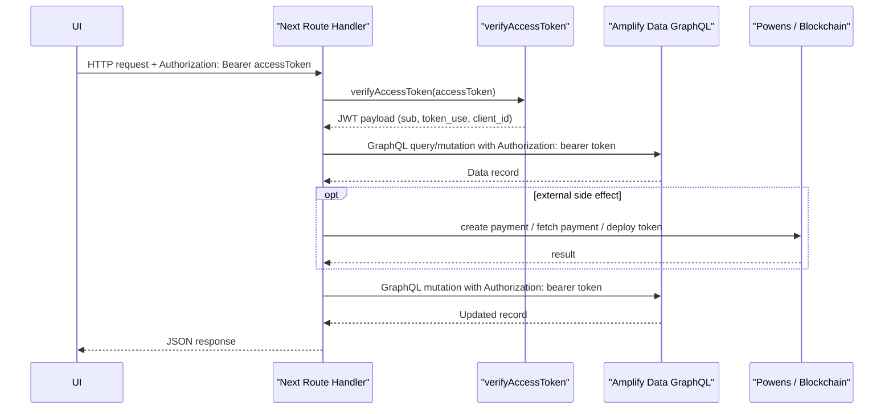

# Bearer JWT Route Auth Summary

## Közös auth minta

## Miért jobb ez

- a route authforrása egyértelmű: a request bearer tokenje
- nincs rejtett szerveroldali Amplify sessionfüggés
- a hibák pontosabban lokalizálhatók
- ugyanaz a JWT megy végig a route authon és az AppSync adathíváson