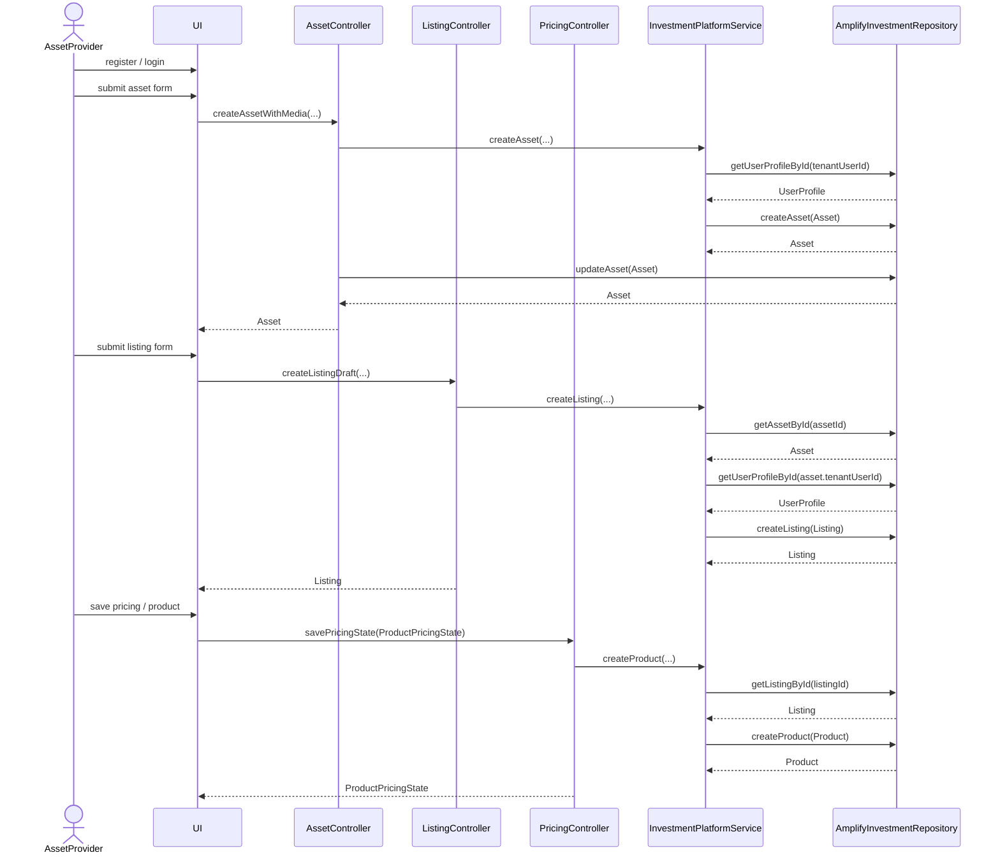
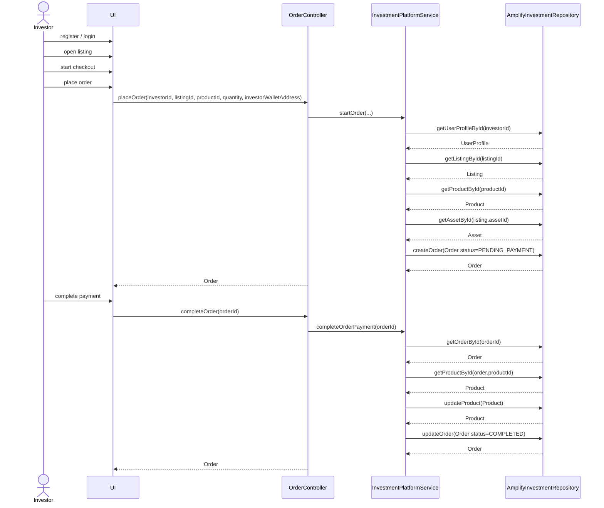

```mermaid
sequenceDiagram
  actor AssetProvider as AssetProvider
  participant UI as UI
  participant AssetController as AssetController
  participant ListingController as ListingController
  participant PricingController as PricingController
  participant Service as InvestmentPlatformService
  participant Repo as AmplifyInvestmentRepository

  AssetProvider->>UI: register / login
  AssetProvider->>UI: submit asset form
  UI->>AssetController: createAssetWithMedia(...)
  AssetController->>Service: createAsset(...)
  Service->>Repo: getUserProfileById(tenantUserId)
  Repo-->>Service: UserProfile
  Service->>Repo: createAsset(Asset)
  Repo-->>Service: Asset
  AssetController->>Repo: updateAsset(Asset)
  Repo-->>AssetController: Asset
  AssetController-->>UI: Asset

  AssetProvider->>UI: submit listing form
  UI->>ListingController: createListingDraft(...)
  ListingController->>Service: createListing(...)
  Service->>Repo: getAssetById(assetId)
  Repo-->>Service: Asset
  Service->>Repo: getUserProfileById(asset.tenantUserId)
  Repo-->>Service: UserProfile
  Service->>Repo: createListing(Listing)
  Repo-->>Service: Listing
  ListingController-->>UI: Listing

  AssetProvider->>UI: save pricing / product
  UI->>PricingController: savePricingState(ProductPricingState)
  PricingController->>Service: createProduct(...)
  Service->>Repo: getListingById(listingId)
  Repo-->>Service: Listing
  Service->>Repo: createProduct(Product)
  Repo-->>Service: Product
  PricingController-->>UI: ProductPricingState
```

## Investor flow

```mermaid
sequenceDiagram
  actor Investor as Investor
  participant UI as UI
  participant OrderController as OrderController
  participant Service as InvestmentPlatformService
  participant Repo as AmplifyInvestmentRepository

  Investor->>UI: register / login
  Investor->>UI: open listing
  Investor->>UI: start checkout
  Investor->>UI: place order
  UI->>OrderController: placeOrder(investorId, listingId, productId, quantity, investorWalletAddress)
  OrderController->>Service: startOrder(...)
  Service->>Repo: getUserProfileById(investorId)
  Repo-->>Service: UserProfile
  Service->>Repo: getListingById(listingId)
  Repo-->>Service: Listing
  Service->>Repo: getProductById(productId)
  Repo-->>Service: Product
  Service->>Repo: getAssetById(listing.assetId)
  Repo-->>Service: Asset
  Service->>Repo: createOrder(Order status=PENDING_PAYMENT)
  Repo-->>Service: Order
  OrderController-->>UI: Order

  Investor->>UI: complete payment
  UI->>OrderController: completeOrder(orderId)
  OrderController->>Service: completeOrderPayment(orderId)
  Service->>Repo: getOrderById(orderId)
  Repo-->>Service: Order
  Service->>Repo: getProductById(order.productId)
  Repo-->>Service: Product
  Service->>Repo: updateProduct(Product)
  Repo-->>Service: Product
  Service->>Repo: updateOrder(Order status=COMPLETED)
  Repo-->>Service: Order
  OrderController-->>UI: Order
```
