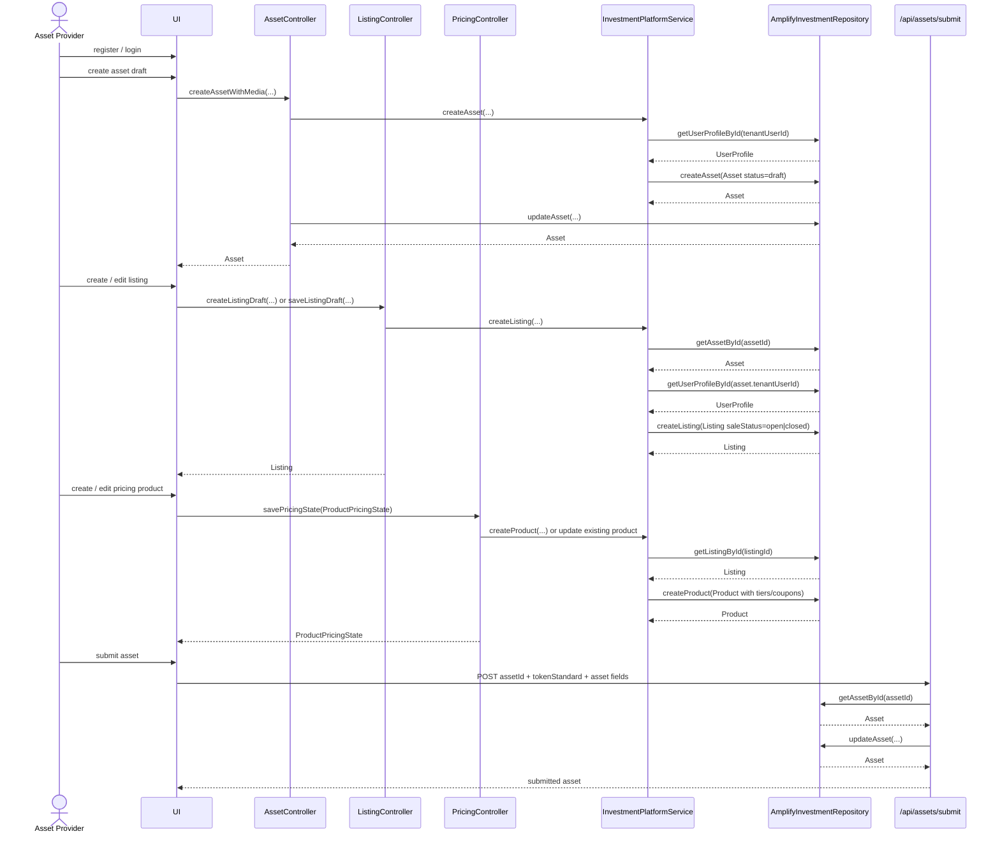
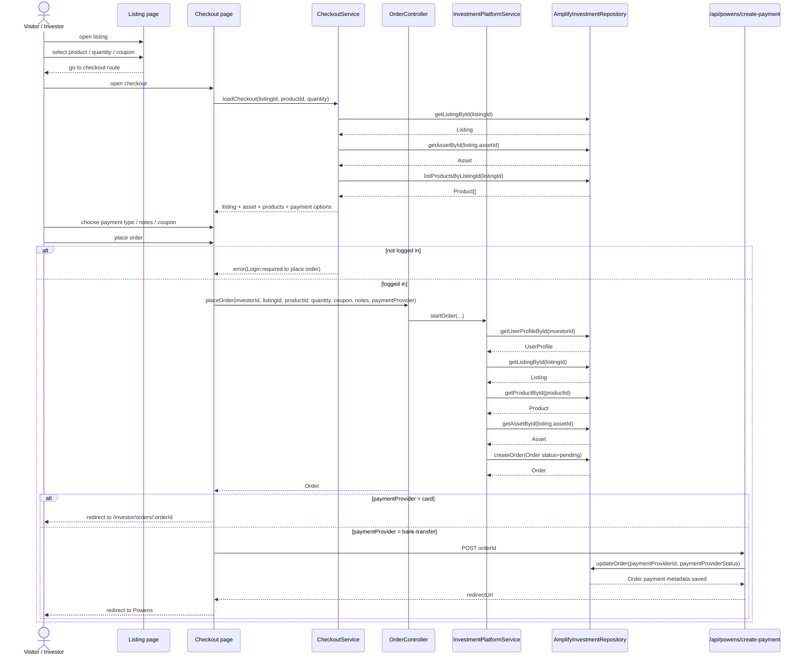
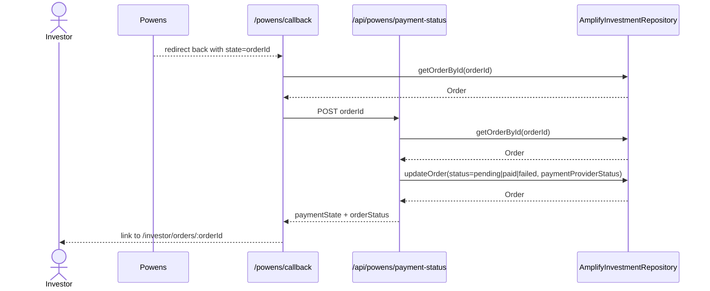
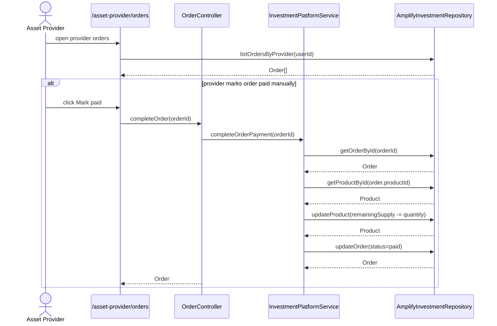

## Asset provider flow

## Visitor and investor checkout flow

## Bank transfer return and payment sync

## Order completion paths

## Notes

- A publikus checkout route és az investor checkout route ugyanazt a `Invest` komponenst használja, csak más `mode`-dal.
- A rendelés létrehozása mindig `pending` státusszal indul.
- A sikeres fizetés utáni rendelés státusza jelenleg `paid`, nem `completed`.
- Bank transfer esetén a payment state és az order state szétválik, és a callback / sync flow frissíti őket.
- A checkout flow ma támogat `coupon`, `notes` és `paymentProvider` mezőket is.
