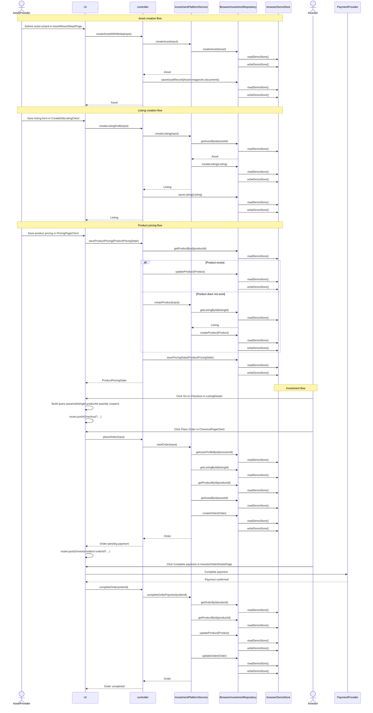

```mermaid
sequenceDiagram
  actor AssetProvider
  participant UI
  participant controller
  participant InvestmentPlatformService
  participant BrowserInvestmentRepository
  participant browserDemoStore
  actor Investor
  participant PaymentProvider

  Note over AssetProvider,browserDemoStore: Asset creation flow
  AssetProvider->>UI: Submit asset wizard in AssetWizardStep4Page
  UI->>controller: createAssetWithMedia(input)
  controller->>InvestmentPlatformService: createAsset(input)
  InvestmentPlatformService->>BrowserInvestmentRepository: createAsset(Asset)
  BrowserInvestmentRepository->>browserDemoStore: readDemoStore()
  BrowserInvestmentRepository->>browserDemoStore: writeDemoStore()
  InvestmentPlatformService-->>controller: Asset
  controller->>BrowserInvestmentRepository: saveAssetRecord(Asset imageUrls documents)
  BrowserInvestmentRepository->>browserDemoStore: readDemoStore()
  BrowserInvestmentRepository->>browserDemoStore: writeDemoStore()
  controller-->>UI: Asset

  Note over AssetProvider,browserDemoStore: Listing creation flow
  AssetProvider->>UI: Save listing form in CreateEditListingClient
  UI->>controller: createListingDraft(input)
  controller->>InvestmentPlatformService: createListing(input)
  InvestmentPlatformService->>BrowserInvestmentRepository: getAssetById(assetId)
  BrowserInvestmentRepository->>browserDemoStore: readDemoStore()
  BrowserInvestmentRepository-->>InvestmentPlatformService: Asset
  InvestmentPlatformService->>BrowserInvestmentRepository: createListing(Listing)
  BrowserInvestmentRepository->>browserDemoStore: readDemoStore()
  BrowserInvestmentRepository->>browserDemoStore: writeDemoStore()
  InvestmentPlatformService-->>controller: Listing
  controller->>BrowserInvestmentRepository: saveListing(Listing)
  BrowserInvestmentRepository->>browserDemoStore: readDemoStore()
  BrowserInvestmentRepository->>browserDemoStore: writeDemoStore()
  controller-->>UI: Listing

  Note over AssetProvider,browserDemoStore: Product pricing flow
  AssetProvider->>UI: Save product pricing in PricingPageClient
  UI->>controller: saveProductPricing(ProductPricingState)
  controller->>BrowserInvestmentRepository: getProductById(productId)
  BrowserInvestmentRepository->>browserDemoStore: readDemoStore()
  alt Product exists
    controller->>BrowserInvestmentRepository: updateProduct(Product)
    BrowserInvestmentRepository->>browserDemoStore: readDemoStore()
    BrowserInvestmentRepository->>browserDemoStore: writeDemoStore()
  else Product does not exist
    controller->>InvestmentPlatformService: createProduct(input)
    InvestmentPlatformService->>BrowserInvestmentRepository: getListingById(listingId)
    BrowserInvestmentRepository->>browserDemoStore: readDemoStore()
    BrowserInvestmentRepository-->>InvestmentPlatformService: Listing
    InvestmentPlatformService->>BrowserInvestmentRepository: createProduct(Product)
    BrowserInvestmentRepository->>browserDemoStore: readDemoStore()
    BrowserInvestmentRepository->>browserDemoStore: writeDemoStore()
  end
  controller->>BrowserInvestmentRepository: savePricingState(ProductPricingState)
  BrowserInvestmentRepository->>browserDemoStore: readDemoStore()
  BrowserInvestmentRepository->>browserDemoStore: writeDemoStore()
  controller-->>UI: ProductPricingState

  Note over Investor,browserDemoStore: Investment flow
  Investor->>UI: Click Go to Checkout in ListingDetails
  UI->>UI: Build query params(listingId productId quantity coupon)
  UI->>UI: router.push(/checkout?... )
  Investor->>UI: Click Place Order in CheckoutPageClient
  UI->>controller: placeOrder(input)
  controller->>InvestmentPlatformService: startOrder(input)
  InvestmentPlatformService->>BrowserInvestmentRepository: getUserProfileById(investorId)
  BrowserInvestmentRepository->>browserDemoStore: readDemoStore()
  InvestmentPlatformService->>BrowserInvestmentRepository: getListingById(listingId)
  BrowserInvestmentRepository->>browserDemoStore: readDemoStore()
  InvestmentPlatformService->>BrowserInvestmentRepository: getProductById(productId)
  BrowserInvestmentRepository->>browserDemoStore: readDemoStore()
  InvestmentPlatformService->>BrowserInvestmentRepository: getAssetById(assetId)
  BrowserInvestmentRepository->>browserDemoStore: readDemoStore()
  InvestmentPlatformService->>BrowserInvestmentRepository: createOrder(Order)
  BrowserInvestmentRepository->>browserDemoStore: readDemoStore()
  BrowserInvestmentRepository->>browserDemoStore: writeDemoStore()
  InvestmentPlatformService-->>controller: Order
  controller-->>UI: Order pending payment
  UI->>UI: router.push(/investor/orders/:orderId?... )

  Investor->>UI: Click Complete payment in InvestorOrderDetailsPage
  UI->>PaymentProvider: Complete payment
  PaymentProvider-->>UI: Payment confirmed
  UI->>controller: completeOrder(orderId)
  controller->>InvestmentPlatformService: completeOrderPayment(orderId)
  InvestmentPlatformService->>BrowserInvestmentRepository: getOrderById(orderId)
  BrowserInvestmentRepository->>browserDemoStore: readDemoStore()
  InvestmentPlatformService->>BrowserInvestmentRepository: getProductById(productId)
  BrowserInvestmentRepository->>browserDemoStore: readDemoStore()
  InvestmentPlatformService->>BrowserInvestmentRepository: updateProduct(Product)
  BrowserInvestmentRepository->>browserDemoStore: readDemoStore()
  BrowserInvestmentRepository->>browserDemoStore: writeDemoStore()
  InvestmentPlatformService->>BrowserInvestmentRepository: updateOrder(Order)
  BrowserInvestmentRepository->>browserDemoStore: readDemoStore()
  BrowserInvestmentRepository->>browserDemoStore: writeDemoStore()
  InvestmentPlatformService-->>controller: Order
  controller-->>UI: Order completed
```
