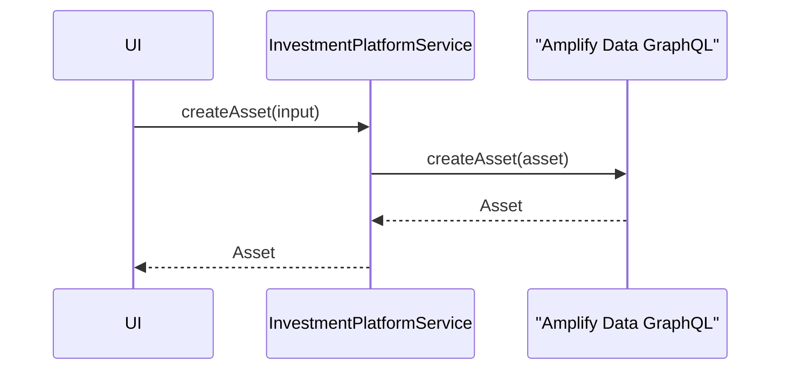
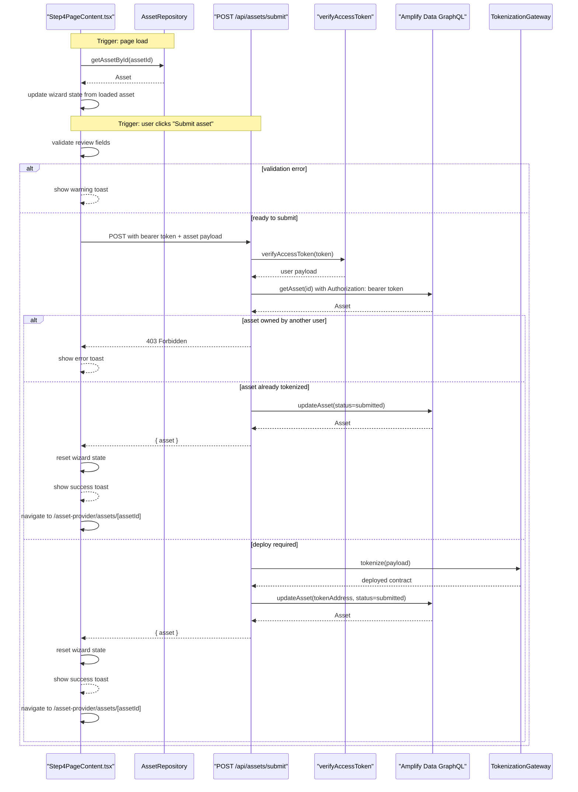
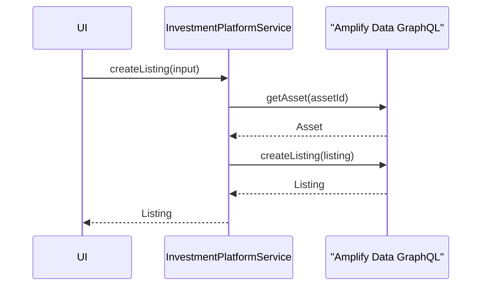
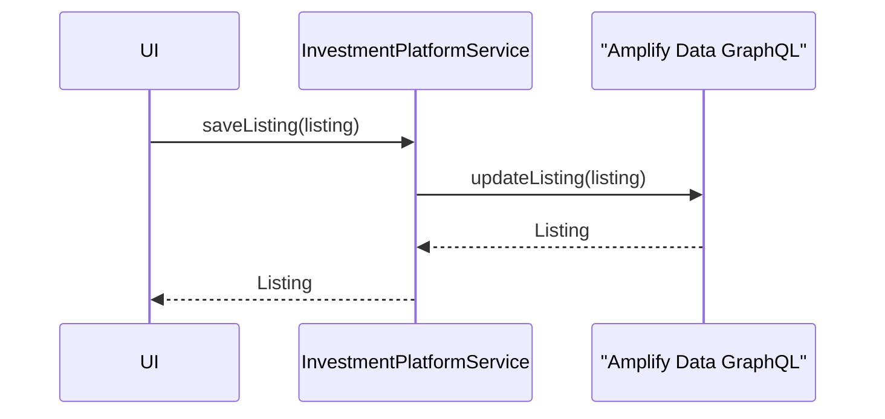
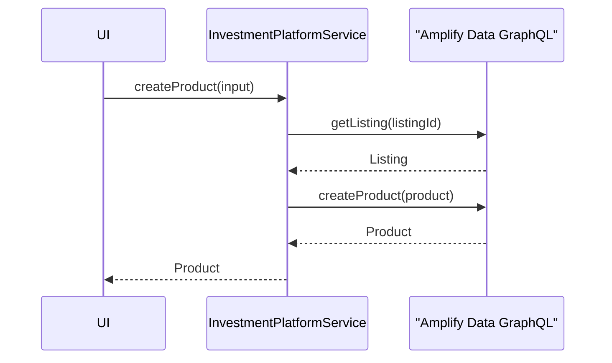
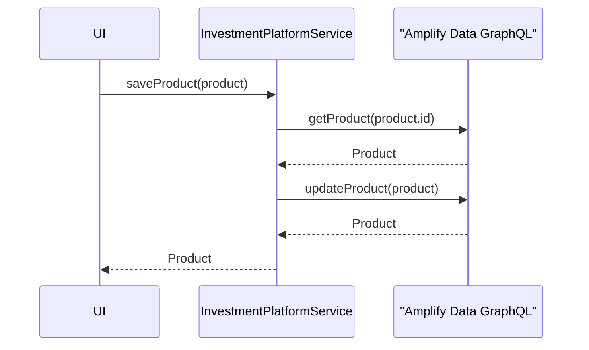

# Asset And Listing Authoring Sequences

## InvestmentPlatformService.createAsset

## AssetSubmissionFlow.submitAsset

## InvestmentPlatformService.createListing

## InvestmentPlatformService.saveListing

## InvestmentPlatformService.createProduct

## InvestmentPlatformService.saveProduct

