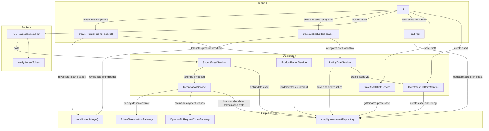

# Asset And Listing Authoring Flowchart

```mermaid
flowchart TB
  subgraph FE["Frontend"]
    UI["UI"]
    ReadPort["ReadPort"]
    ListingEditorFacade["createListingEditorFacade()"]
    ProductPricingFacade["createProductPricingFacade()"]
  end

  subgraph BE["Backend"]
    SubmitAssetAPI["POST /api/assets/submit"]
    VerifyToken["verifyAccessToken"]
  end

  subgraph APP["Application"]
    InvestmentPlatformService["InvestmentPlatformService"]
    SaveAssetDraftService["SaveAssetDraftService"]
    ListingDraftService["ListingDraftService"]
    ProductPricingService["ProductPricingService"]
    SubmitAssetService["SubmitAssetService"]
    TokenizationService["TokenizationService"]
  end

  subgraph OUT["Output adapters"]
    AmplifyInvestmentRepository["AmplifyInvestmentRepository"]
    RevalidateClient["revalidateListings()"]
    RequestClaimGateway["DynamoDbRequestClaimGateway"]
    TokenizationGateway["EthersTokenizationGateway"]
  end

  UI -->|create asset| InvestmentPlatformService
  UI -->|save draft| SaveAssetDraftService
  UI -->|load asset for submit| ReadPort
  UI -->|submit asset| SubmitAssetAPI
  UI -->|create or save listing draft| ListingEditorFacade
  UI -->|create or save pricing| ProductPricingFacade

  ReadPort -->|read asset and listing data| AmplifyInvestmentRepository

  SubmitAssetAPI --> VerifyToken
  SubmitAssetAPI -->|calls| SubmitAssetService

  InvestmentPlatformService -->|create asset and listing| AmplifyInvestmentRepository
  SaveAssetDraftService -->|get/create/update asset| AmplifyInvestmentRepository

  ListingEditorFacade -->|delegates draft workflow| ListingDraftService
  ListingEditorFacade -->|revalidates listing pages| RevalidateClient
  ListingDraftService -->|create listing via| InvestmentPlatformService
  ListingDraftService -->|save and delete listing| AmplifyInvestmentRepository

  ProductPricingFacade -->|delegates product workflow| ProductPricingService
  ProductPricingFacade -->|revalidates listing pages| RevalidateClient
  ProductPricingService -->|load/save/delete product| AmplifyInvestmentRepository

  SubmitAssetService -->|get/update asset| AmplifyInvestmentRepository
  SubmitAssetService -->|tokenize if needed| TokenizationService
  TokenizationService -->|loads and updates tokenization state| AmplifyInvestmentRepository
  TokenizationService -->|claims deployment request| RequestClaimGateway
  TokenizationService -->|deploys token contract| TokenizationGateway
```
