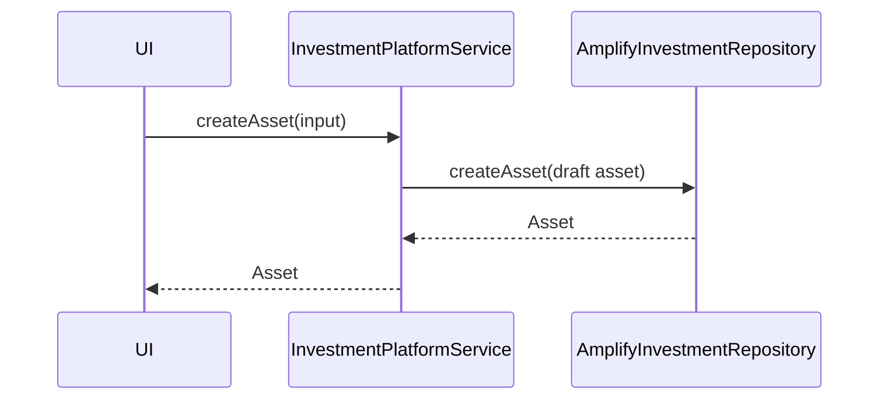
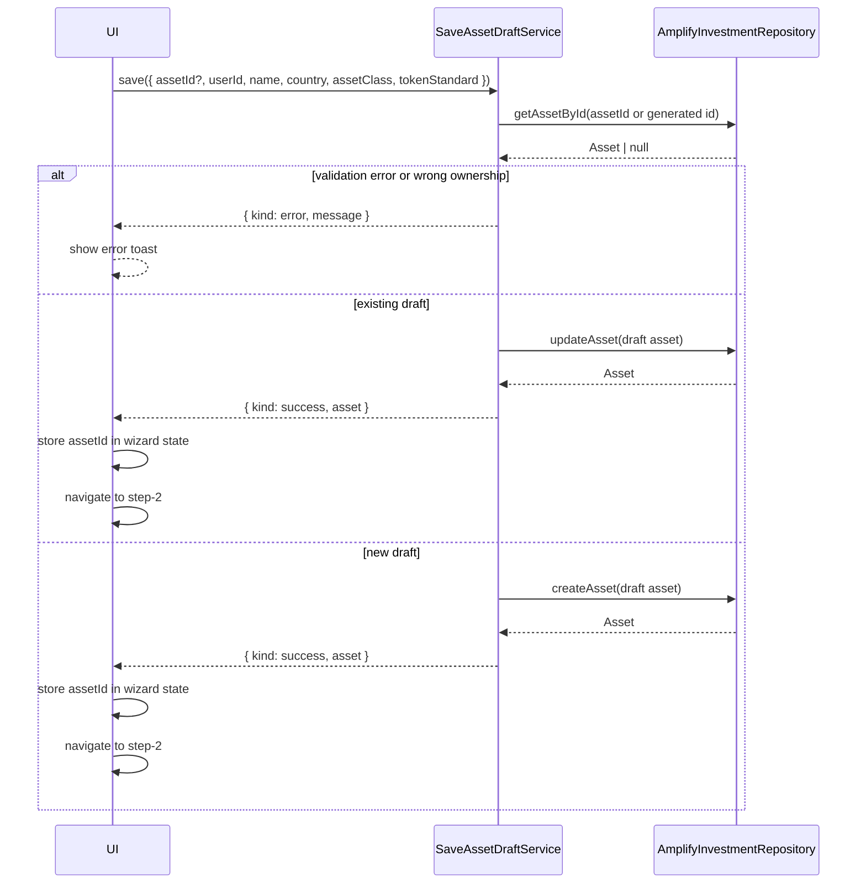
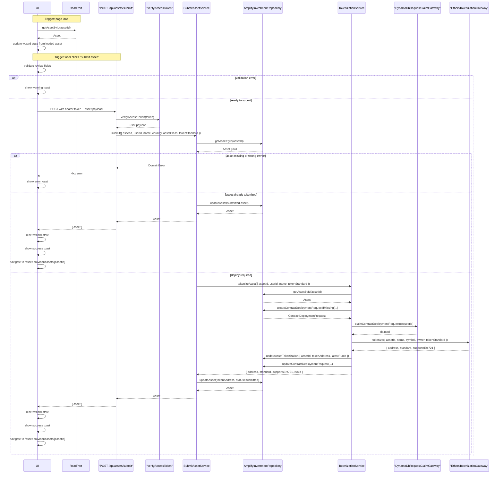
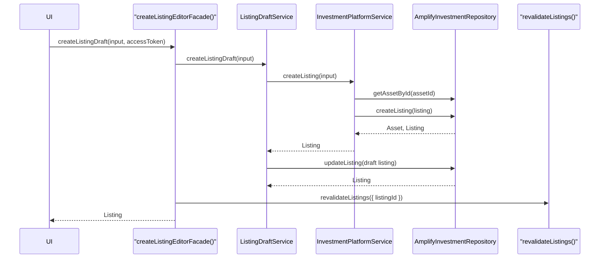
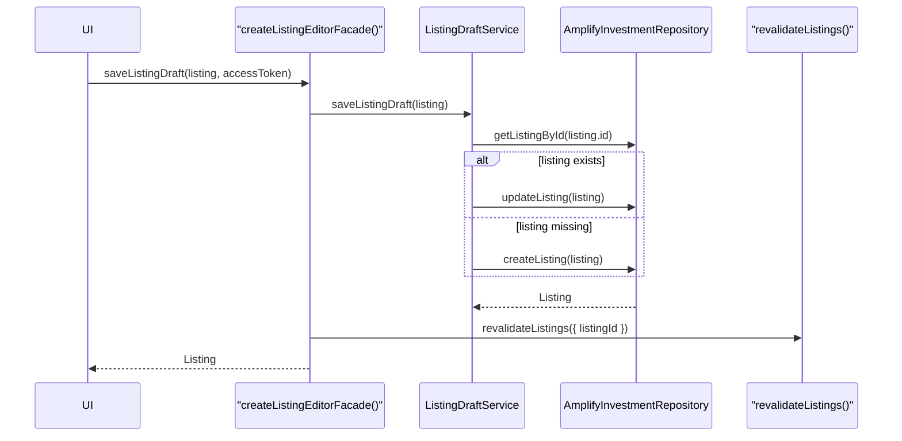
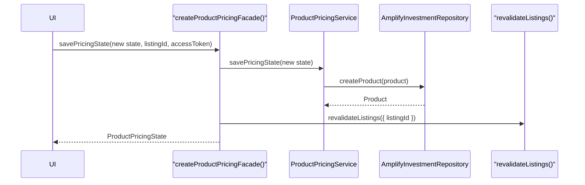
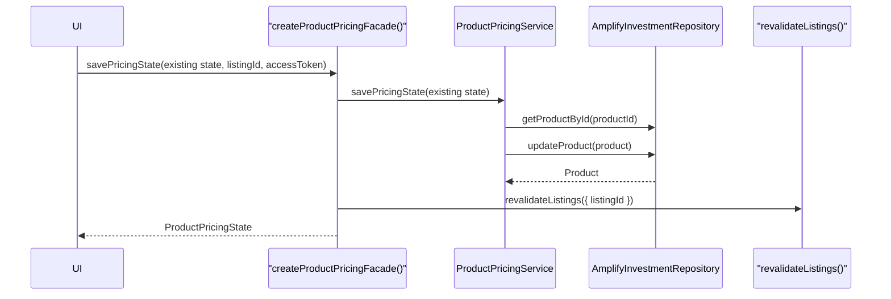

# Asset And Listing Authoring Sequences

## 1. Asset Creation

## 2. Asset Draft Save

## 3. Asset Submission

## 4. Listing Draft Creation

## 5. Listing Draft Save

## 6. Product Creation

## 7. Product Save

