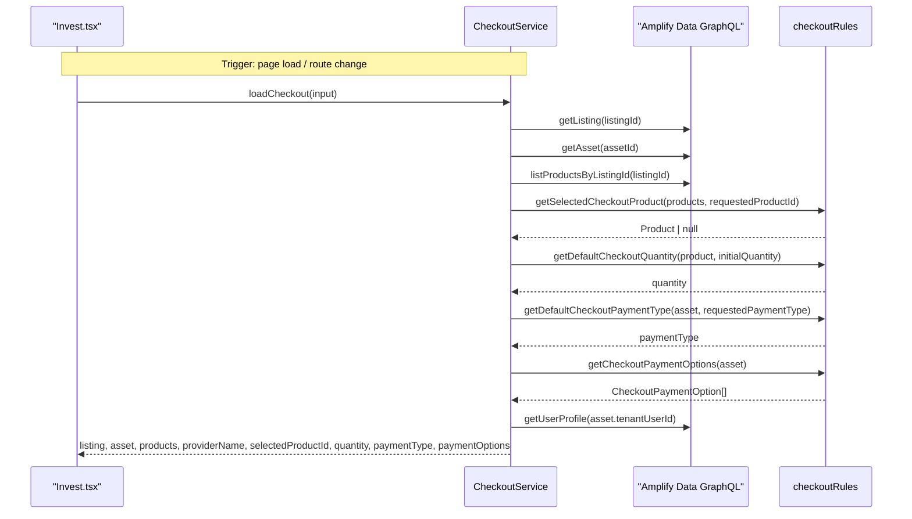
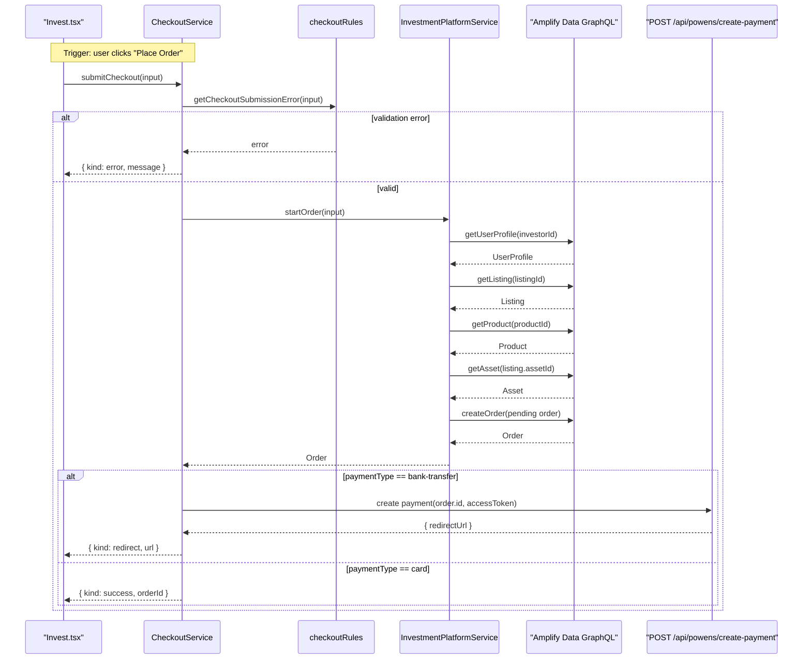
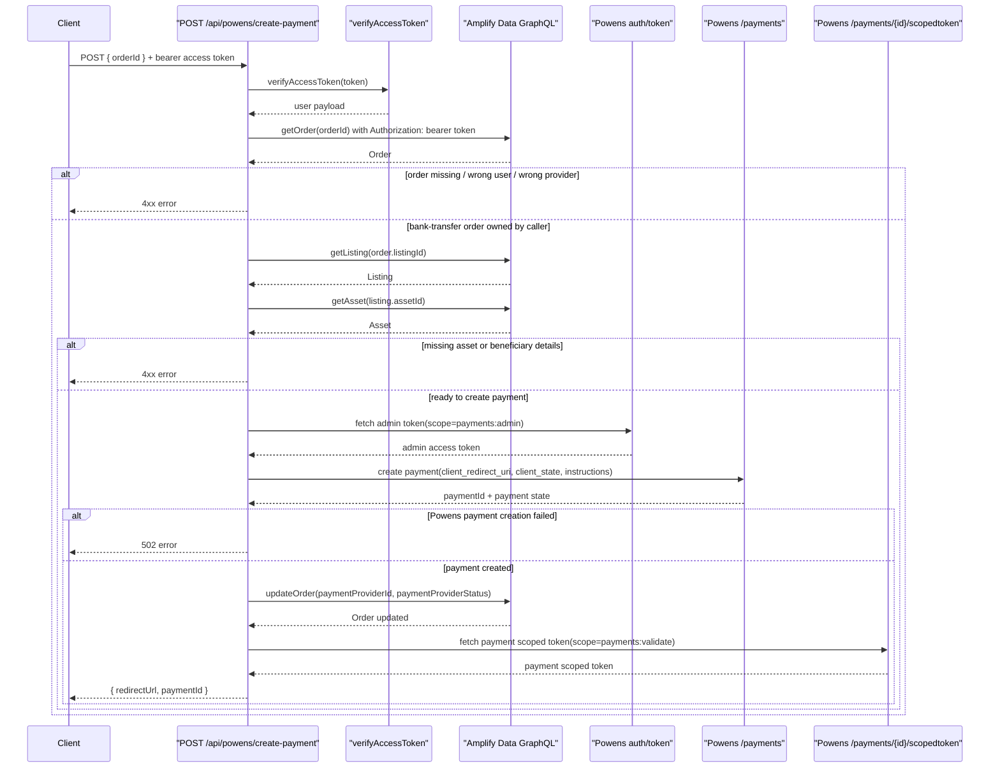
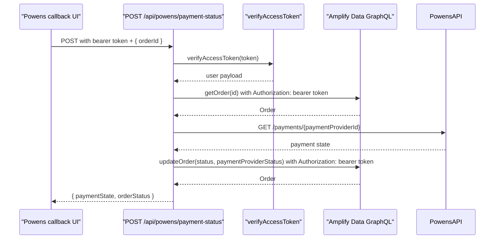
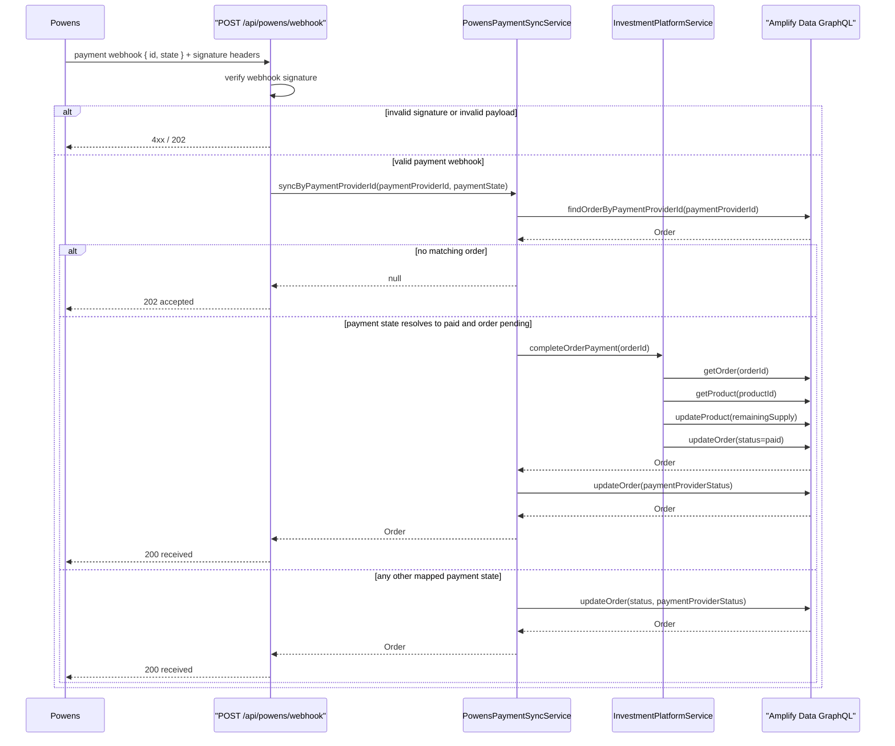

# Checkout And Payments Sequences

## CheckoutService.loadCheckout

## Checkout End-to-End

## POST /api/powens/create-payment

## PowensPaymentSync.pullFromCallbackUi

## PowensPaymentSync.pushFromPowensWebhook

