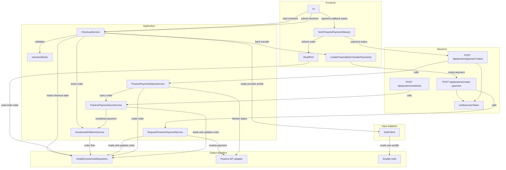

# Checkout And Payments Flowchart

```mermaid
flowchart TB
  subgraph FE["Frontend"]
    UI["UI"]
    PaymentClient["createPowensBankTransferPayment()"]
    PaymentStatusFacade["fetchPowensPaymentStatus()"]
    ReadPort["ReadPort"]
  end

  subgraph IN["Input adapters"]
    AuthClient["AuthClient"]
  end

  subgraph BE["Backend"]
    CreatePaymentAPI["POST /api/powens/create-payment"]
    PaymentStatusAPI["POST /api/powens/payment-status"]
    WebhookAPI["POST /api/powens/webhook"]
    VerifyToken["verifyAccessToken"]
  end

  subgraph APP["Application"]
    CheckoutService["CheckoutService"]
    InvestmentPlatformService["InvestmentPlatformService"]
    RequestPowensPaymentService["RequestPowensPaymentService"]
    PowensPaymentStatusService["PowensPaymentStatusService"]
    PowensPaymentSyncService["PowensPaymentSyncService"]
    checkoutRules["checkoutRules"]
  end

  subgraph OUT["Output adapters"]
    AmplifyInvestmentRepository["AmplifyInvestmentRepository"]
    PowensAPI["Powens API adapter"]
    AmplifyAuth["Amplify Auth"]
  end

  UI -->|load checkout| CheckoutService
  UI -->|submit checkout| CheckoutService
  UI -->|payment callback status| PaymentStatusFacade

  CheckoutService -->|reads checkout data| AmplifyInvestmentRepository
  CheckoutService -->|reads provider profile| AuthClient
  CheckoutService -->|validates| checkoutRules
  CheckoutService -->|starts order| InvestmentPlatformService
  CheckoutService -->|bank transfer| PaymentClient
  AuthClient -->|reads user profile| AmplifyAuth

  PaymentClient -->|create payment| CreatePaymentAPI
  PaymentStatusFacade -->|payment status| PaymentStatusAPI
  PaymentStatusFacade -->|refresh order| ReadPort
  ReadPort -->|read order state| AmplifyInvestmentRepository

  CreatePaymentAPI --> VerifyToken
  CreatePaymentAPI -->|calls| RequestPowensPaymentService

  PaymentStatusAPI --> VerifyToken
  PaymentStatusAPI -->|calls| PowensPaymentStatusService

  WebhookAPI -->|calls| PowensPaymentSyncService

  InvestmentPlatformService -->|order flow| AmplifyInvestmentRepository
  RequestPowensPaymentService -->|loads and updates order| AmplifyInvestmentRepository
  RequestPowensPaymentService -->|creates payment| PowensAPI
  PowensPaymentStatusService -->|loads order| AmplifyInvestmentRepository
  PowensPaymentStatusService -->|fetches status| PowensAPI
  PowensPaymentStatusService -->|syncs order| PowensPaymentSyncService
  PowensPaymentSyncService -->|loads and updates order| AmplifyInvestmentRepository
  PowensPaymentSyncService -->|completes payment| InvestmentPlatformService
```
