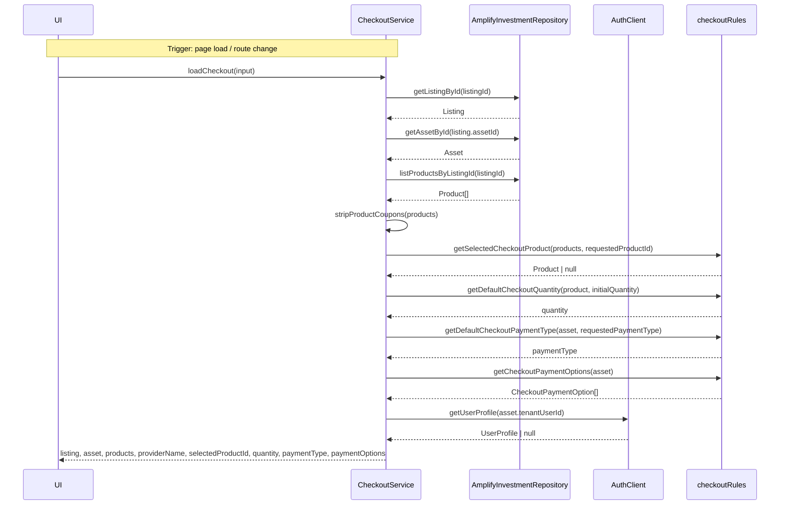
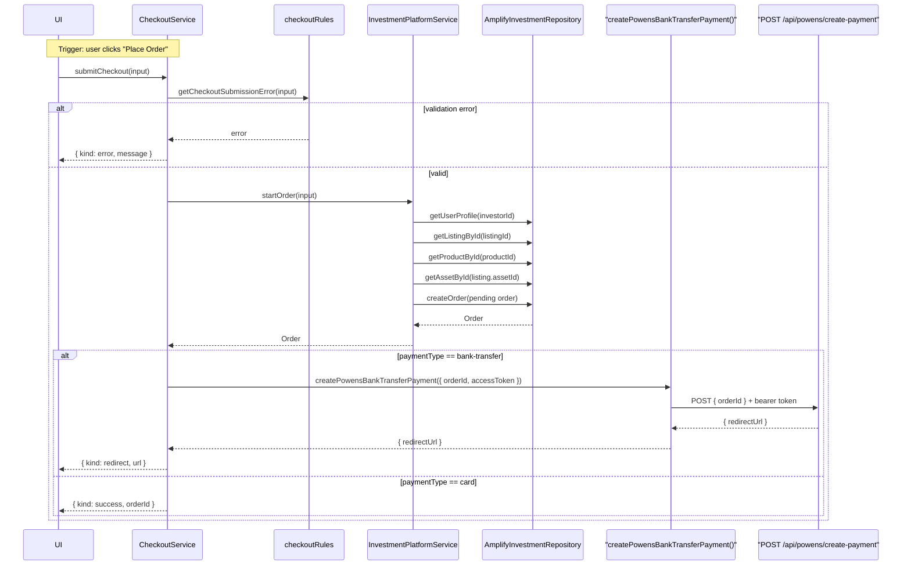
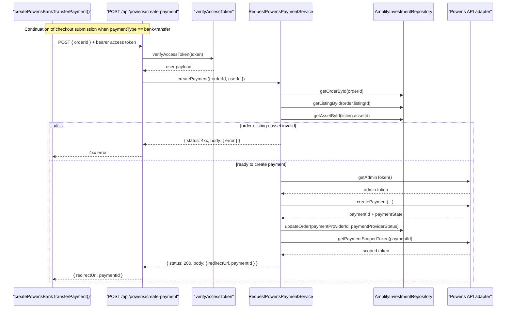
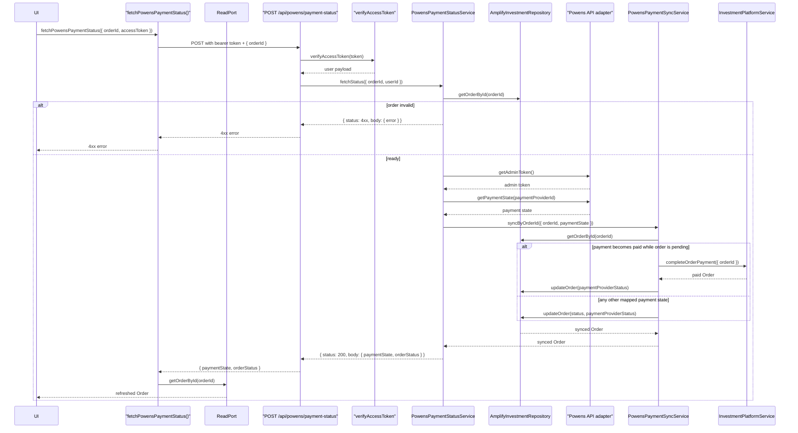
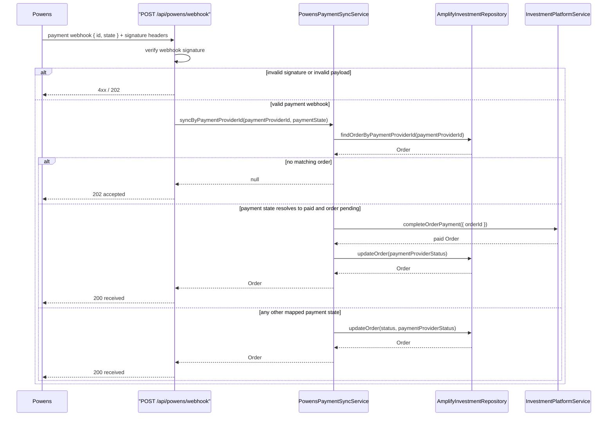

# Checkout And Payments Sequences

## 1. Checkout Load

```mermaid
sequenceDiagram
  participant UI
  participant CheckoutService
  participant AmplifyInvestmentRepository
  participant AuthClient
  participant checkoutRules

  Note over UI,CheckoutService: Trigger: page load / route change
  UI->>CheckoutService: loadCheckout(input)
  CheckoutService->>AmplifyInvestmentRepository: getListingById(listingId)
  AmplifyInvestmentRepository-->>CheckoutService: Listing
  CheckoutService->>AmplifyInvestmentRepository: getAssetById(listing.assetId)
  AmplifyInvestmentRepository-->>CheckoutService: Asset
  CheckoutService->>AmplifyInvestmentRepository: listProductsByListingId(listingId)
  AmplifyInvestmentRepository-->>CheckoutService: Product[]
  CheckoutService->>CheckoutService: stripProductCoupons(products)
  CheckoutService->>checkoutRules: getSelectedCheckoutProduct(products, requestedProductId)
  checkoutRules-->>CheckoutService: Product | null
  CheckoutService->>checkoutRules: getDefaultCheckoutQuantity(product, initialQuantity)
  checkoutRules-->>CheckoutService: quantity
  CheckoutService->>checkoutRules: getDefaultCheckoutPaymentType(asset, requestedPaymentType)
  checkoutRules-->>CheckoutService: paymentType
  CheckoutService->>checkoutRules: getCheckoutPaymentOptions(asset)
  checkoutRules-->>CheckoutService: CheckoutPaymentOption[]
  CheckoutService->>AuthClient: getUserProfile(asset.tenantUserId)
  AuthClient-->>CheckoutService: UserProfile | null
  CheckoutService-->>UI: listing, asset, products, providerName, selectedProductId, quantity, paymentType, paymentOptions
```

## 2. Checkout Submission

```mermaid
sequenceDiagram
  participant UI
  participant CheckoutService
  participant checkoutRules
  participant InvestmentPlatformService
  participant AmplifyInvestmentRepository
  participant PaymentClient as "createPowensBankTransferPayment()"
  participant PowensAPI as "POST /api/powens/create-payment"

  Note over UI,CheckoutService: Trigger: user clicks "Place Order"
  UI->>CheckoutService: submitCheckout(input)
  CheckoutService->>checkoutRules: getCheckoutSubmissionError(input)
  alt validation error
    checkoutRules-->>CheckoutService: error
    CheckoutService-->>UI: { kind: error, message }
  else valid
    CheckoutService->>InvestmentPlatformService: startOrder(input)
    InvestmentPlatformService->>AmplifyInvestmentRepository: getUserProfile(investorId)
    InvestmentPlatformService->>AmplifyInvestmentRepository: getListingById(listingId)
    InvestmentPlatformService->>AmplifyInvestmentRepository: getProductById(productId)
    InvestmentPlatformService->>AmplifyInvestmentRepository: getAssetById(listing.assetId)
    InvestmentPlatformService->>AmplifyInvestmentRepository: createOrder(pending order)
    AmplifyInvestmentRepository-->>InvestmentPlatformService: Order
    InvestmentPlatformService-->>CheckoutService: Order
    alt paymentType == bank-transfer
      CheckoutService->>PaymentClient: createPowensBankTransferPayment({ orderId, accessToken })
      PaymentClient->>PowensAPI: POST { orderId } + bearer token
      PowensAPI-->>PaymentClient: { redirectUrl }
      PaymentClient-->>CheckoutService: { redirectUrl }
      CheckoutService-->>UI: { kind: redirect, url }
    else paymentType == card
      CheckoutService-->>UI: { kind: success, orderId }
    end
  end
```

## 3. Payment Creation

```mermaid
sequenceDiagram
  participant PaymentClient as "createPowensBankTransferPayment()"
  participant CreatePaymentAPI as "POST /api/powens/create-payment"
  participant VerifyToken as "verifyAccessToken"
  participant RequestPowensPaymentService
  participant AmplifyInvestmentRepository
  participant PowensAPI as "Powens API adapter"

  Note over PaymentClient,CreatePaymentAPI: Continuation of checkout submission when paymentType == bank-transfer
  PaymentClient->>CreatePaymentAPI: POST { orderId } + bearer access token
  CreatePaymentAPI->>VerifyToken: verifyAccessToken(token)
  VerifyToken-->>CreatePaymentAPI: user payload
  CreatePaymentAPI->>RequestPowensPaymentService: createPayment({ orderId, userId })
  RequestPowensPaymentService->>AmplifyInvestmentRepository: getOrderById(orderId)
  RequestPowensPaymentService->>AmplifyInvestmentRepository: getListingById(order.listingId)
  RequestPowensPaymentService->>AmplifyInvestmentRepository: getAssetById(listing.assetId)
  alt order / listing / asset invalid
    RequestPowensPaymentService-->>CreatePaymentAPI: { status: 4xx, body: { error } }
    CreatePaymentAPI-->>PaymentClient: 4xx error
  else ready to create payment
    RequestPowensPaymentService->>PowensAPI: getAdminToken()
    PowensAPI-->>RequestPowensPaymentService: admin token
    RequestPowensPaymentService->>PowensAPI: createPayment(...)
    PowensAPI-->>RequestPowensPaymentService: paymentId + paymentState
    RequestPowensPaymentService->>AmplifyInvestmentRepository: updateOrder(paymentProviderId, paymentProviderStatus)
    RequestPowensPaymentService->>PowensAPI: getPaymentScopedToken(paymentId)
    PowensAPI-->>RequestPowensPaymentService: scoped token
    RequestPowensPaymentService-->>CreatePaymentAPI: { status: 200, body: { redirectUrl, paymentId } }
    CreatePaymentAPI-->>PaymentClient: { redirectUrl, paymentId }
  end
```

## 4. Payment Status Sync

```mermaid
sequenceDiagram
  participant UI
  participant PaymentStatusFacade as "fetchPowensPaymentStatus()"
  participant ReadPort
  participant PaymentStatusAPI as "POST /api/powens/payment-status"
  participant VerifyToken as "verifyAccessToken"
  participant PowensPaymentStatusService
  participant AmplifyInvestmentRepository
  participant PowensAPI as "Powens API adapter"
  participant PowensPaymentSyncService
  participant InvestmentPlatformService

  UI->>PaymentStatusFacade: fetchPowensPaymentStatus({ orderId, accessToken })
  PaymentStatusFacade->>PaymentStatusAPI: POST with bearer token + { orderId }
  PaymentStatusAPI->>VerifyToken: verifyAccessToken(token)
  VerifyToken-->>PaymentStatusAPI: user payload
  PaymentStatusAPI->>PowensPaymentStatusService: fetchStatus({ orderId, userId })
  PowensPaymentStatusService->>AmplifyInvestmentRepository: getOrderById(orderId)
  alt order invalid
    PowensPaymentStatusService-->>PaymentStatusAPI: { status: 4xx, body: { error } }
    PaymentStatusAPI-->>PaymentStatusFacade: 4xx error
    PaymentStatusFacade-->>UI: 4xx error
  else ready
    PowensPaymentStatusService->>PowensAPI: getAdminToken()
    PowensAPI-->>PowensPaymentStatusService: admin token
    PowensPaymentStatusService->>PowensAPI: getPaymentState(paymentProviderId)
    PowensAPI-->>PowensPaymentStatusService: payment state
    PowensPaymentStatusService->>PowensPaymentSyncService: syncByOrderId({ orderId, paymentState })
    PowensPaymentSyncService->>AmplifyInvestmentRepository: getOrderById(orderId)
    alt payment becomes paid while order is pending
      PowensPaymentSyncService->>InvestmentPlatformService: completeOrderPayment({ orderId })
      InvestmentPlatformService-->>PowensPaymentSyncService: paid Order
      PowensPaymentSyncService->>AmplifyInvestmentRepository: updateOrder(paymentProviderStatus)
    else any other mapped payment state
      PowensPaymentSyncService->>AmplifyInvestmentRepository: updateOrder(status, paymentProviderStatus)
    end
    AmplifyInvestmentRepository-->>PowensPaymentSyncService: synced Order
    PowensPaymentSyncService-->>PowensPaymentStatusService: synced Order
    PowensPaymentStatusService-->>PaymentStatusAPI: { status: 200, body: { paymentState, orderStatus } }
    PaymentStatusAPI-->>PaymentStatusFacade: { paymentState, orderStatus }
    PaymentStatusFacade->>ReadPort: getOrderById(orderId)
    ReadPort-->>UI: refreshed Order
  end
```

## 5. Payment Webhook Sync

```mermaid
sequenceDiagram
  participant Powens
  participant WebhookAPI as "POST /api/powens/webhook"
  participant PowensPaymentSyncService
  participant AmplifyInvestmentRepository
  participant InvestmentPlatformService

  Powens->>WebhookAPI: payment webhook { id, state } + signature headers
  WebhookAPI->>WebhookAPI: verify webhook signature
  alt invalid signature or invalid payload
    WebhookAPI-->>Powens: 4xx / 202
  else valid payment webhook
    WebhookAPI->>PowensPaymentSyncService: syncByPaymentProviderId(paymentProviderId, paymentState)
    PowensPaymentSyncService->>AmplifyInvestmentRepository: findOrderByPaymentProviderId(paymentProviderId)
    AmplifyInvestmentRepository-->>PowensPaymentSyncService: Order
    alt no matching order
      PowensPaymentSyncService-->>WebhookAPI: null
      WebhookAPI-->>Powens: 202 accepted
    else payment state resolves to paid and order pending
      PowensPaymentSyncService->>InvestmentPlatformService: completeOrderPayment({ orderId })
      InvestmentPlatformService-->>PowensPaymentSyncService: paid Order
      PowensPaymentSyncService->>AmplifyInvestmentRepository: updateOrder(paymentProviderStatus)
      AmplifyInvestmentRepository-->>PowensPaymentSyncService: Order
      PowensPaymentSyncService-->>WebhookAPI: Order
      WebhookAPI-->>Powens: 200 received
    else any other mapped payment state
      PowensPaymentSyncService->>AmplifyInvestmentRepository: updateOrder(status, paymentProviderStatus)
      AmplifyInvestmentRepository-->>PowensPaymentSyncService: Order
      PowensPaymentSyncService-->>WebhookAPI: Order
      WebhookAPI-->>Powens: 200 received
    end
  end
```
