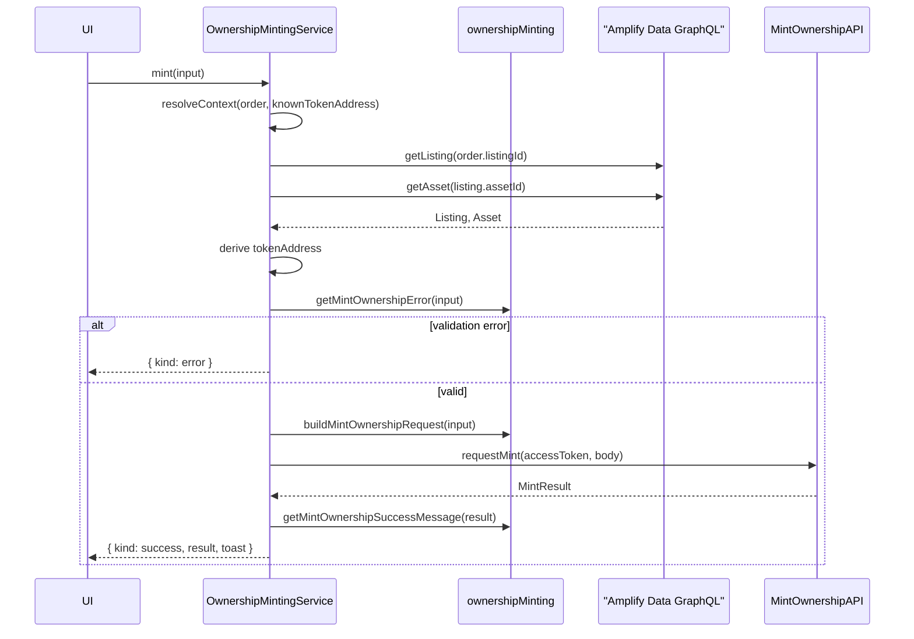
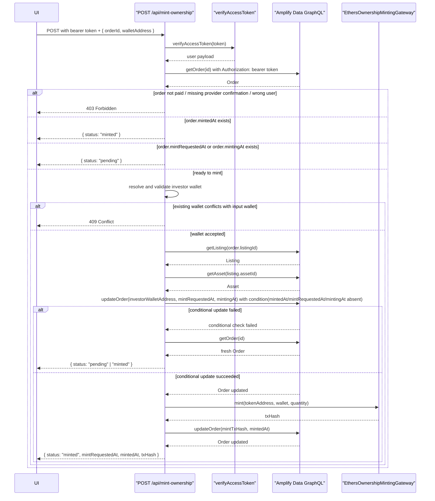

# Tokenization And Minting Sequences

## OwnershipMintingService.mint

```mermaid
sequenceDiagram
  participant UI
  participant OwnershipMintingService
  participant ownershipMinting
  participant AppSyncGraphQL as "Amplify Data GraphQL"
  participant MintOwnershipAPI

  UI->>OwnershipMintingService: mint(input)
  OwnershipMintingService->>OwnershipMintingService: resolveContext(order, knownTokenAddress)
  OwnershipMintingService->>AppSyncGraphQL: getListing(order.listingId)
  OwnershipMintingService->>AppSyncGraphQL: getAsset(listing.assetId)
  AppSyncGraphQL-->>OwnershipMintingService: Listing, Asset
  OwnershipMintingService->>OwnershipMintingService: derive tokenAddress
  OwnershipMintingService->>ownershipMinting: getMintOwnershipError(input)
  alt validation error
    OwnershipMintingService-->>UI: { kind: error }
  else valid
    OwnershipMintingService->>ownershipMinting: buildMintOwnershipRequest(input)
    OwnershipMintingService->>MintOwnershipAPI: requestMint(accessToken, body)
    MintOwnershipAPI-->>OwnershipMintingService: MintResult
    OwnershipMintingService->>ownershipMinting: getMintOwnershipSuccessMessage(result)
    OwnershipMintingService-->>UI: { kind: success, result, toast }
  end
```

## POST /api/mint-ownership

```mermaid
sequenceDiagram
  participant UI
  participant MintOwnershipAPI as "POST /api/mint-ownership"
  participant VerifyToken as "verifyAccessToken"
  participant AppSyncGraphQL as "Amplify Data GraphQL"
  participant MintGateway as "EthersOwnershipMintingGateway"

  UI->>MintOwnershipAPI: POST with bearer token + { orderId, walletAddress }
  MintOwnershipAPI->>VerifyToken: verifyAccessToken(token)
  VerifyToken-->>MintOwnershipAPI: user payload
  MintOwnershipAPI->>AppSyncGraphQL: getOrder(id) with Authorization: bearer token
  AppSyncGraphQL-->>MintOwnershipAPI: Order
  alt order not paid / missing provider confirmation / wrong user
    MintOwnershipAPI-->>UI: 403 Forbidden
  else order.mintedAt exists
    MintOwnershipAPI-->>UI: { status: "minted" }
  else order.mintRequestedAt or order.mintingAt exists
    MintOwnershipAPI-->>UI: { status: "pending" }
  else ready to mint
    MintOwnershipAPI->>MintOwnershipAPI: resolve and validate investor wallet
    alt existing wallet conflicts with input wallet
      MintOwnershipAPI-->>UI: 409 Conflict
    else wallet accepted
      MintOwnershipAPI->>AppSyncGraphQL: getListing(order.listingId)
      AppSyncGraphQL-->>MintOwnershipAPI: Listing
      MintOwnershipAPI->>AppSyncGraphQL: getAsset(listing.assetId)
      AppSyncGraphQL-->>MintOwnershipAPI: Asset
      MintOwnershipAPI->>AppSyncGraphQL: updateOrder(investorWalletAddress, mintRequestedAt, mintingAt) with condition(mintedAt/mintRequestedAt/mintingAt absent)
      alt conditional update failed
        AppSyncGraphQL-->>MintOwnershipAPI: conditional check failed
        MintOwnershipAPI->>AppSyncGraphQL: getOrder(id)
        AppSyncGraphQL-->>MintOwnershipAPI: fresh Order
        MintOwnershipAPI-->>UI: { status: "pending" | "minted" }
      else conditional update succeeded
        AppSyncGraphQL-->>MintOwnershipAPI: Order updated
        MintOwnershipAPI->>MintGateway: mint(tokenAddress, wallet, quantity)
        MintGateway-->>MintOwnershipAPI: txHash
        MintOwnershipAPI->>AppSyncGraphQL: updateOrder(mintTxHash, mintedAt)
        AppSyncGraphQL-->>MintOwnershipAPI: Order updated
        MintOwnershipAPI-->>UI: { status: "minted", mintRequestedAt, mintedAt, txHash }
      end
    end
  end
```
