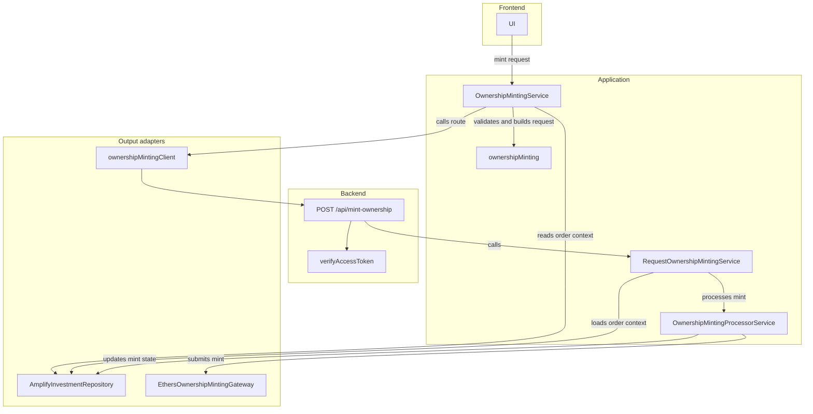

# Tokenization And Minting Flowchart

```mermaid
flowchart TB
  subgraph FE["Frontend"]
    UI["UI"]
  end

  subgraph BE["Backend"]
    MintOwnershipAPI["POST /api/mint-ownership"]
    VerifyToken["verifyAccessToken"]
  end

  subgraph APP["Application"]
    OwnershipMintingService["OwnershipMintingService"]
    RequestOwnershipMintingService["RequestOwnershipMintingService"]
    OwnershipMintingProcessorService["OwnershipMintingProcessorService"]
    ownershipMinting["ownershipMinting"]
  end

  subgraph OUT["Output adapters"]
    AmplifyInvestmentRepository["AmplifyInvestmentRepository"]
    MintGateway["EthersOwnershipMintingGateway"]
    OwnershipMintingClient["ownershipMintingClient"]
  end

  UI -->|mint request| OwnershipMintingService
  OwnershipMintingService -->|reads order context| AmplifyInvestmentRepository
  OwnershipMintingService -->|validates and builds request| ownershipMinting
  OwnershipMintingService -->|calls route| OwnershipMintingClient

  OwnershipMintingClient --> MintOwnershipAPI
  MintOwnershipAPI --> VerifyToken
  MintOwnershipAPI -->|calls| RequestOwnershipMintingService

  RequestOwnershipMintingService -->|loads order context| AmplifyInvestmentRepository
  RequestOwnershipMintingService -->|processes mint| OwnershipMintingProcessorService
  OwnershipMintingProcessorService -->|updates mint state| AmplifyInvestmentRepository
  OwnershipMintingProcessorService -->|submits mint| MintGateway
```
