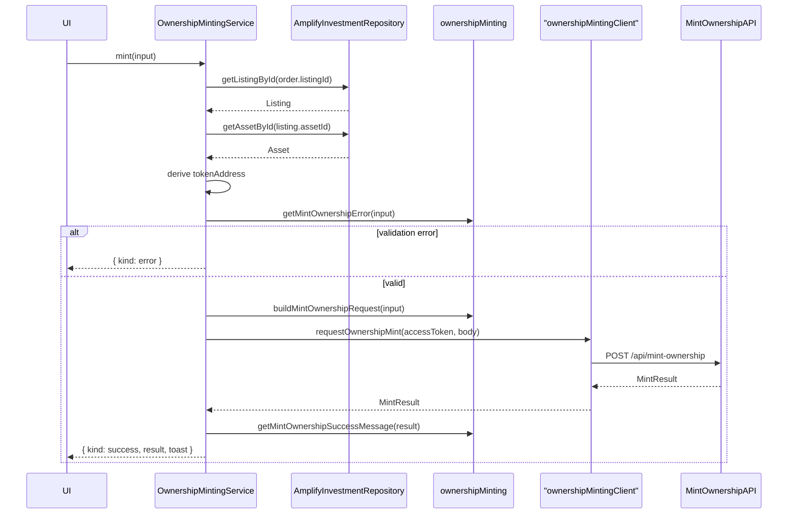
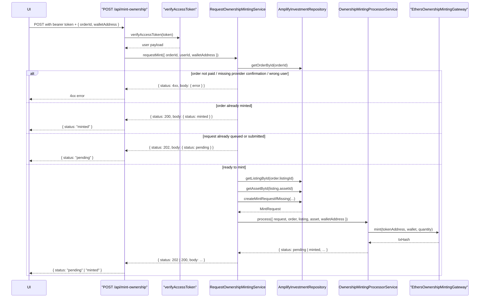

# Tokenization And Minting Sequences

## 1. Ownership Mint Request

```mermaid
sequenceDiagram
  participant UI
  participant OwnershipMintingService
  participant AmplifyInvestmentRepository
  participant ownershipMinting
  participant MintOwnershipClient as "ownershipMintingClient"
  participant MintOwnershipAPI

  UI->>OwnershipMintingService: mint(input)
  OwnershipMintingService->>AmplifyInvestmentRepository: getListingById(order.listingId)
  AmplifyInvestmentRepository-->>OwnershipMintingService: Listing
  OwnershipMintingService->>AmplifyInvestmentRepository: getAssetById(listing.assetId)
  AmplifyInvestmentRepository-->>OwnershipMintingService: Asset
  OwnershipMintingService->>OwnershipMintingService: derive tokenAddress
  OwnershipMintingService->>ownershipMinting: getMintOwnershipError(input)
  alt validation error
    OwnershipMintingService-->>UI: { kind: error }
  else valid
    OwnershipMintingService->>ownershipMinting: buildMintOwnershipRequest(input)
    OwnershipMintingService->>MintOwnershipClient: requestOwnershipMint(accessToken, body)
    MintOwnershipClient->>MintOwnershipAPI: POST /api/mint-ownership
    MintOwnershipAPI-->>MintOwnershipClient: MintResult
    MintOwnershipClient-->>OwnershipMintingService: MintResult
    OwnershipMintingService->>ownershipMinting: getMintOwnershipSuccessMessage(result)
    OwnershipMintingService-->>UI: { kind: success, result, toast }
  end
```

## 2. Ownership Mint Processing

```mermaid
sequenceDiagram
  participant UI
  participant MintOwnershipAPI as "POST /api/mint-ownership"
  participant VerifyToken as "verifyAccessToken"
  participant RequestOwnershipMintingService
  participant AmplifyInvestmentRepository
  participant OwnershipMintingProcessorService
  participant MintGateway as "EthersOwnershipMintingGateway"

  UI->>MintOwnershipAPI: POST with bearer token + { orderId, walletAddress }
  MintOwnershipAPI->>VerifyToken: verifyAccessToken(token)
  VerifyToken-->>MintOwnershipAPI: user payload
  MintOwnershipAPI->>RequestOwnershipMintingService: requestMint({ orderId, userId, walletAddress })
  RequestOwnershipMintingService->>AmplifyInvestmentRepository: getOrderById(orderId)
  alt order not paid / missing provider confirmation / wrong user
    RequestOwnershipMintingService-->>MintOwnershipAPI: { status: 4xx, body: { error } }
    MintOwnershipAPI-->>UI: 4xx error
  else order already minted
    RequestOwnershipMintingService-->>MintOwnershipAPI: { status: 200, body: { status: minted } }
    MintOwnershipAPI-->>UI: { status: "minted" }
  else request already queued or submitted
    RequestOwnershipMintingService-->>MintOwnershipAPI: { status: 202, body: { status: pending } }
    MintOwnershipAPI-->>UI: { status: "pending" }
  else ready to mint
    RequestOwnershipMintingService->>AmplifyInvestmentRepository: getListingById(order.listingId)
    RequestOwnershipMintingService->>AmplifyInvestmentRepository: getAssetById(listing.assetId)
    RequestOwnershipMintingService->>AmplifyInvestmentRepository: createMintRequestIfMissing(...)
    AmplifyInvestmentRepository-->>RequestOwnershipMintingService: MintRequest
    RequestOwnershipMintingService->>OwnershipMintingProcessorService: process({ request, order, listing, asset, walletAddress })
    OwnershipMintingProcessorService->>MintGateway: mint(tokenAddress, wallet, quantity)
    MintGateway-->>OwnershipMintingProcessorService: txHash
    OwnershipMintingProcessorService-->>RequestOwnershipMintingService: { status: pending | minted, ... }
    RequestOwnershipMintingService-->>MintOwnershipAPI: { status: 202 | 200, body: ... }
    MintOwnershipAPI-->>UI: { status: "pending" | "minted" }
  end
```
