# Account, Blog, And Public Content Sequences

## AccountSettingsService.saveProviderSettings

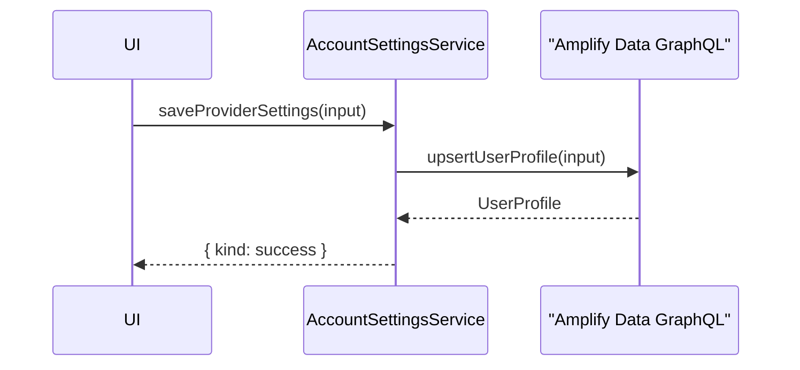

## AccountSettingsService.saveInvestorSettings

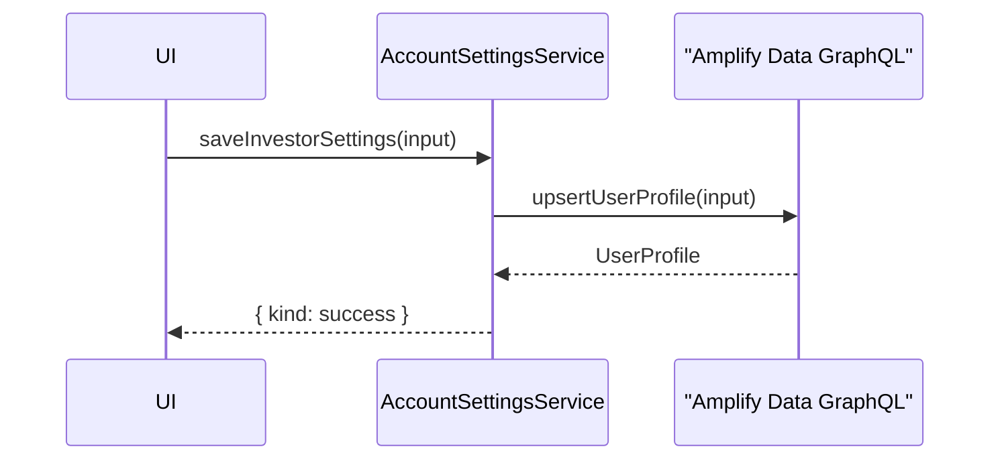

## AccountSettingsService.deleteAccount

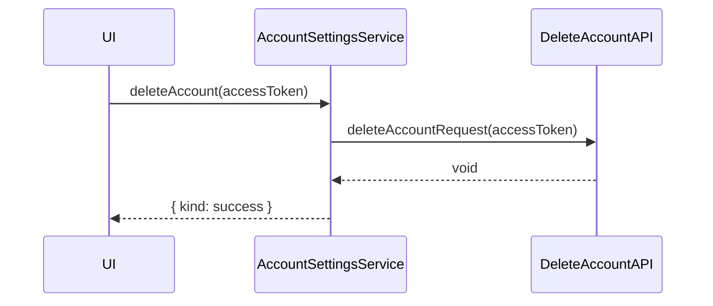

## BlogPostAdminService.loadPosts

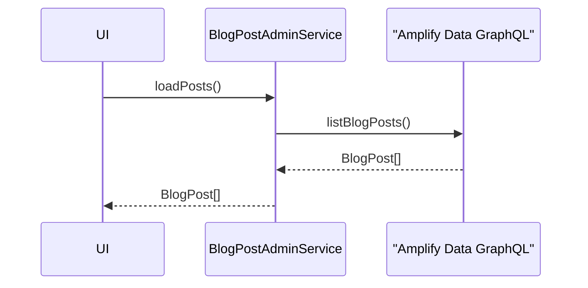

## BlogPostAdminService.validate

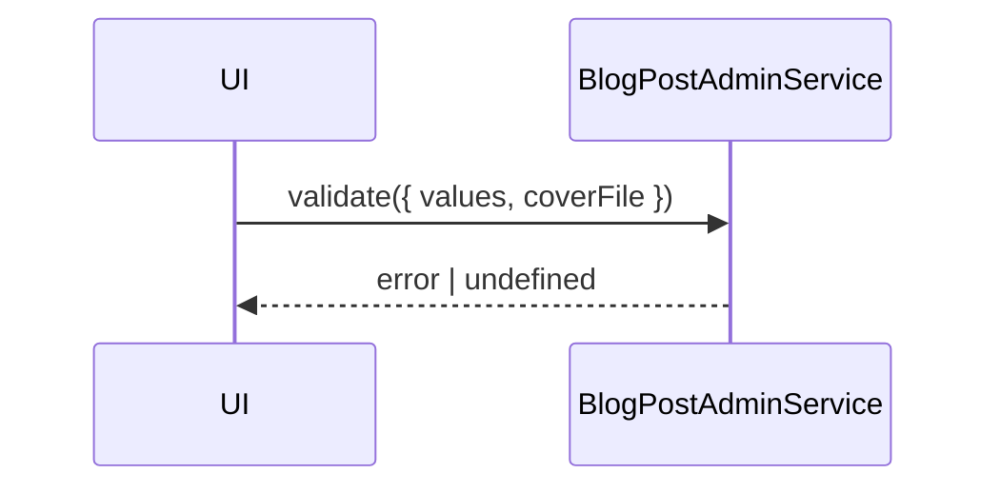

## BlogPostAdminService.save

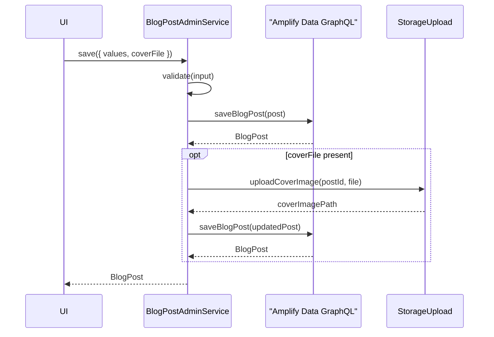

## BlogPostAdminService.delete

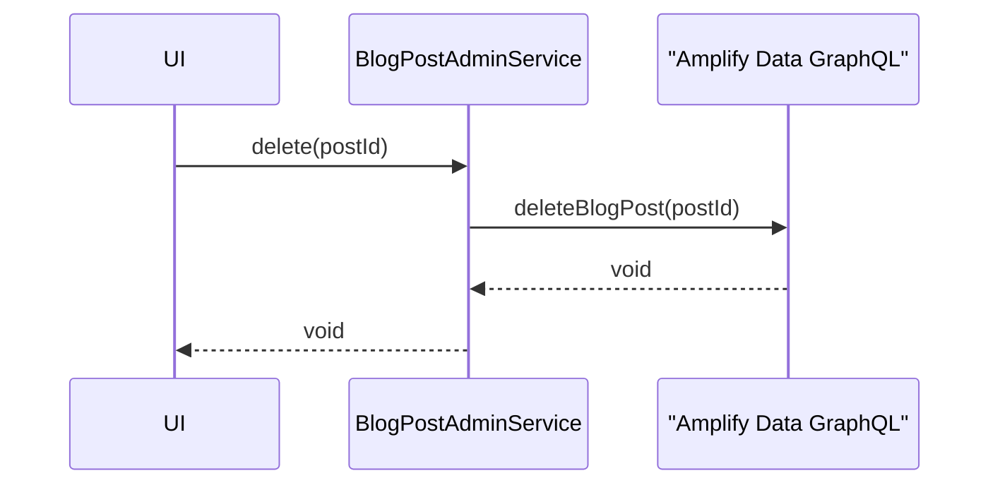

## publicContent.listPublicListings

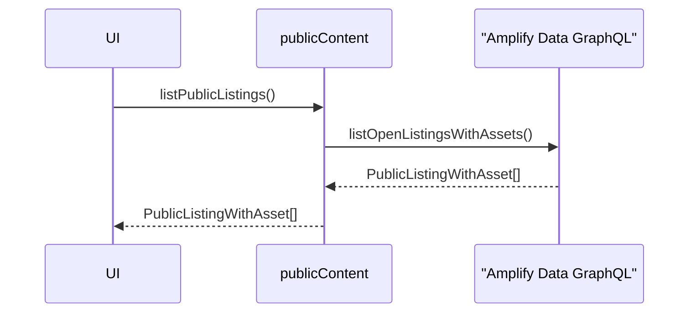

## publicContent.getPublicListingDetails

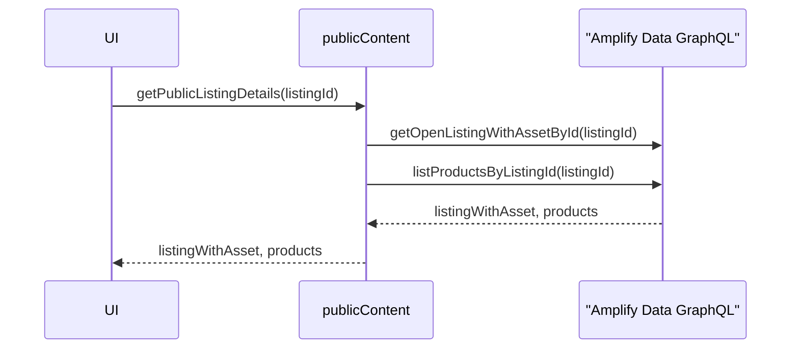

## publicContent.listPublicBlogPosts

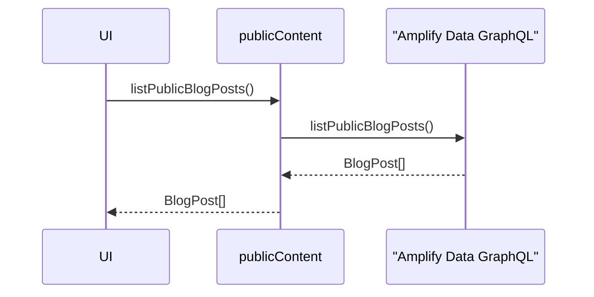

## publicContent.getPublicBlogPost

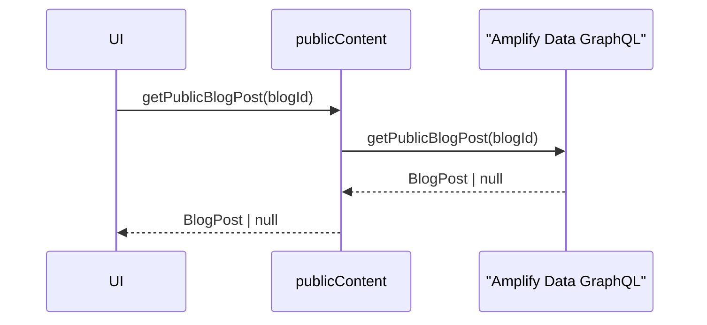

## publicContent.getInvestorOrderEntry

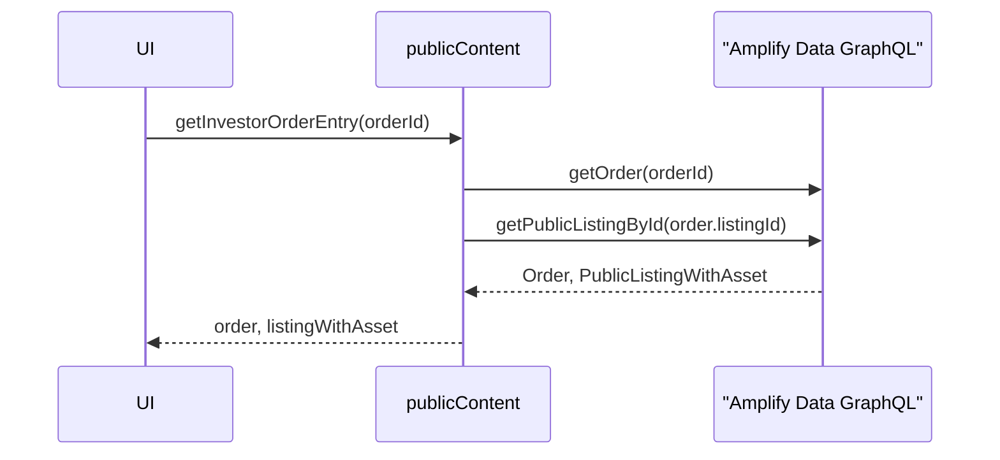
