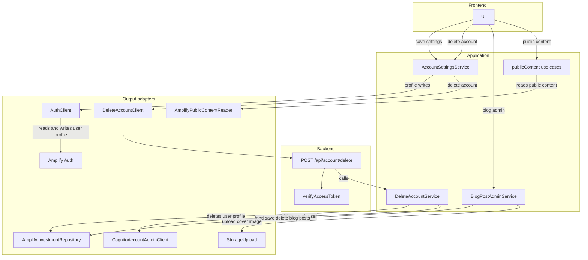

# Account Blog And Public Content Flowchart

```mermaid
flowchart TB
  subgraph FE["Frontend"]
    UI["UI"]
  end

  subgraph BE["Backend"]
    DeleteAccountAPI["POST /api/account/delete"]
    VerifyToken["verifyAccessToken"]
  end

  subgraph APP["Application"]
    AccountSettingsService["AccountSettingsService"]
    DeleteAccountService["DeleteAccountService"]
    BlogPostAdminService["BlogPostAdminService"]
    PublicContent["publicContent use cases"]
  end

  subgraph OUT["Output adapters"]
    AuthClient["AuthClient"]
    AmplifyInvestmentRepository["AmplifyInvestmentRepository"]
    AmplifyPublicContentReader["AmplifyPublicContentReader"]
    StorageUpload["StorageUpload"]
    AmplifyAuth["Amplify Auth"]
    DeleteAccountClient["DeleteAccountClient"]
    CognitoAccountAdminClient["CognitoAccountAdminClient"]
  end

  UI -->|save settings| AccountSettingsService
  UI -->|delete account| AccountSettingsService
  UI -->|blog admin| BlogPostAdminService
  UI -->|public content| PublicContent

  AccountSettingsService -->|profile writes| AuthClient
  AccountSettingsService -->|delete account| DeleteAccountClient
  AuthClient -->|reads and writes user profile| AmplifyAuth
  DeleteAccountClient --> DeleteAccountAPI
  DeleteAccountAPI --> VerifyToken
  DeleteAccountAPI -->|calls| DeleteAccountService
  DeleteAccountService -->|deletes user profile| AmplifyInvestmentRepository
  DeleteAccountService -->|deletes auth user| CognitoAccountAdminClient

  BlogPostAdminService -->|load save delete blog posts| AmplifyInvestmentRepository
  BlogPostAdminService -->|upload cover image| StorageUpload

  PublicContent -->|reads public content| AmplifyPublicContentReader
```
