# Account, Blog, And Public Content Sequences

## 1. Provider Settings Save

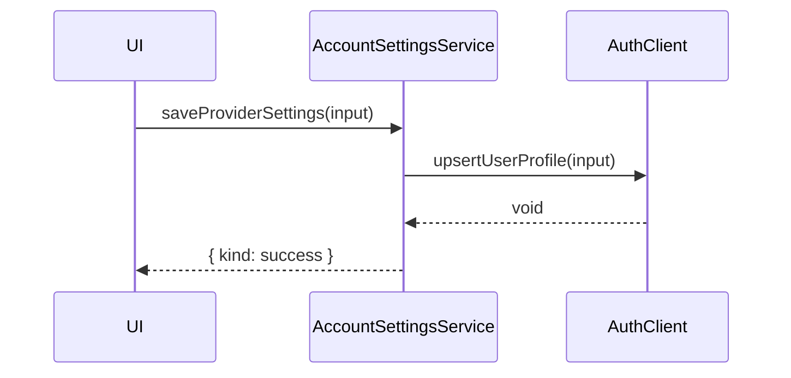

## 2. Investor Settings Save

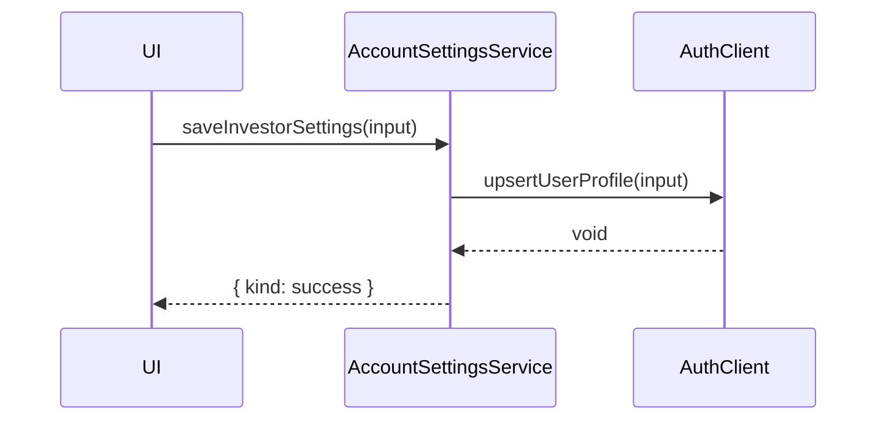

## 3. Account Deletion

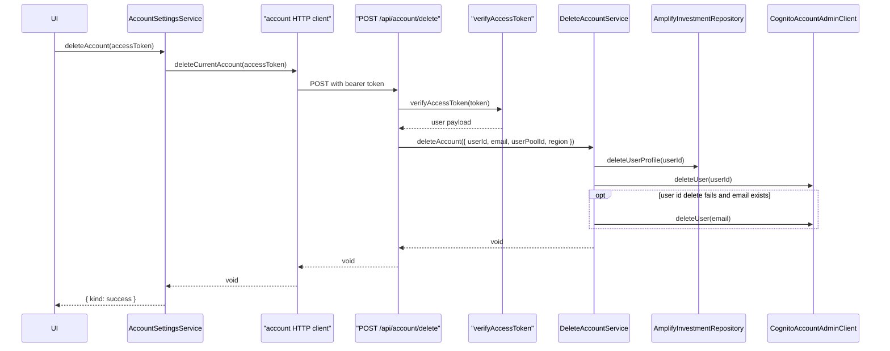

## 4. Blog Post Load

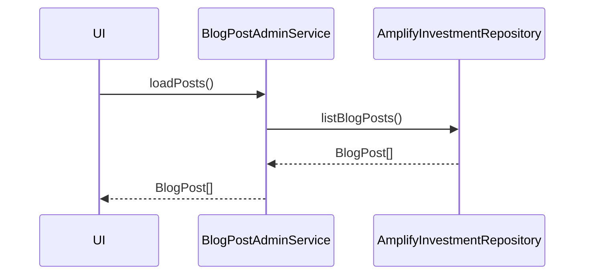

## 5. Blog Post Validation

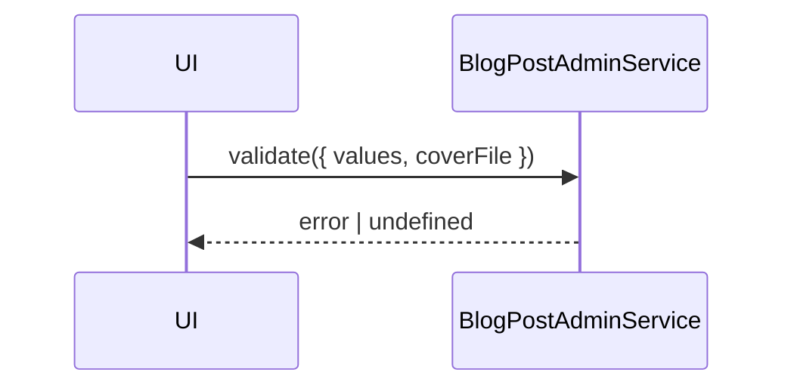

## 6. Blog Post Save

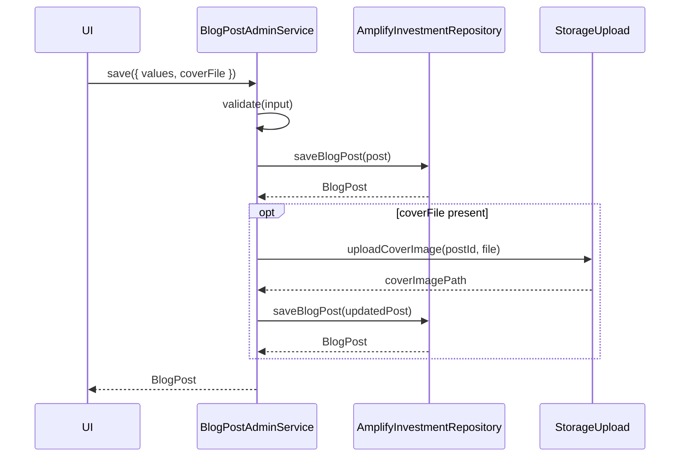

## 7. Blog Post Delete

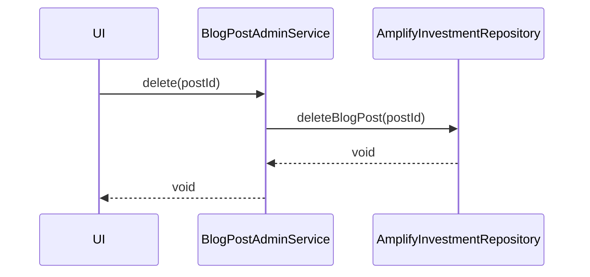

## 8. Public Listings

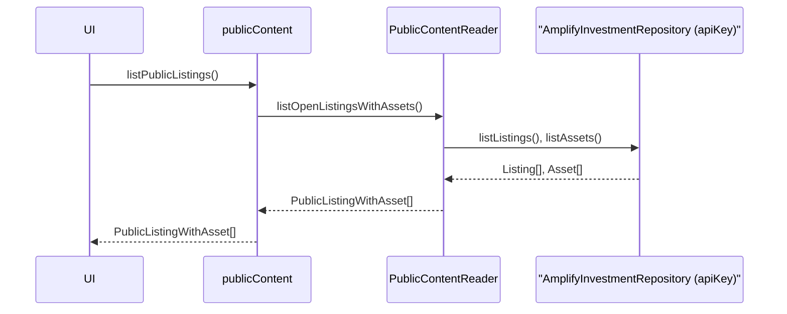

## 9. Public Listing Details

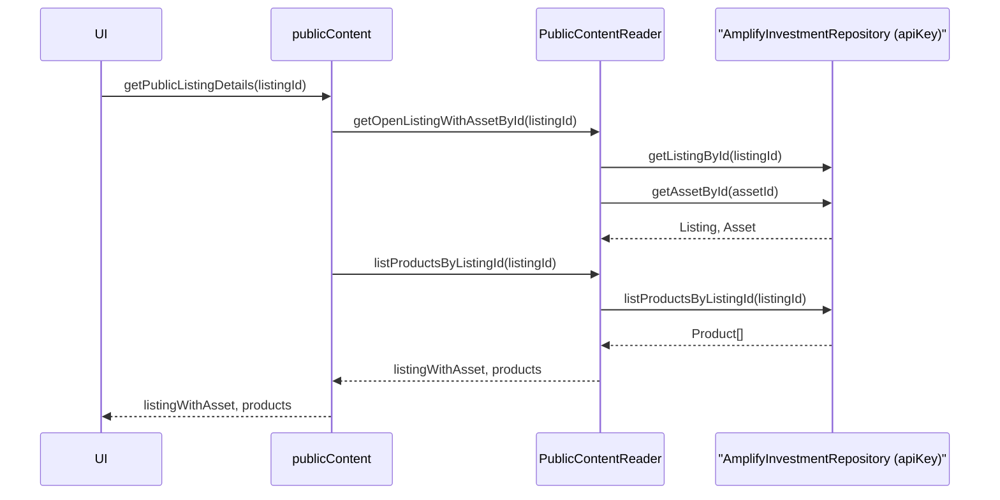

## 10. Public Blog List

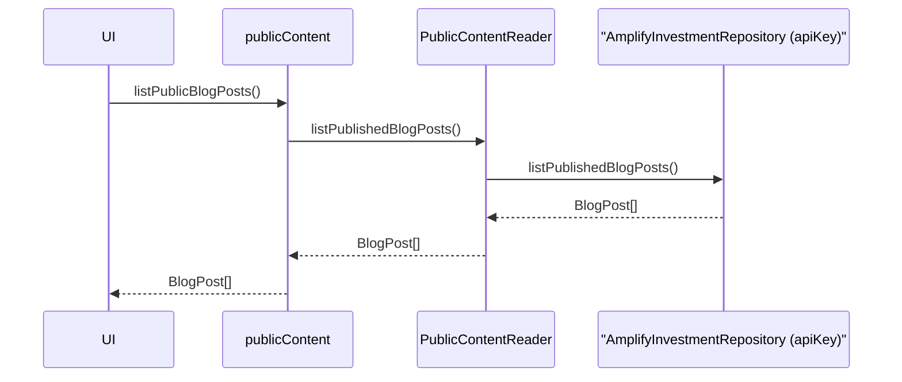

## 11. Public Blog Details

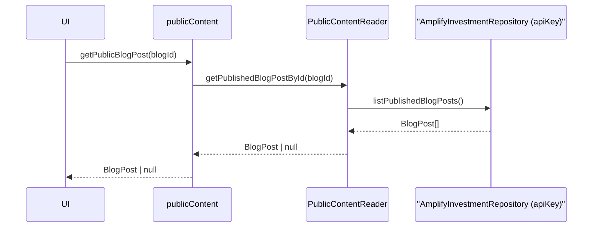

## 12. Investor Order Entry

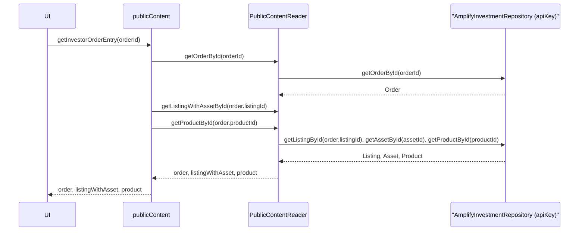
