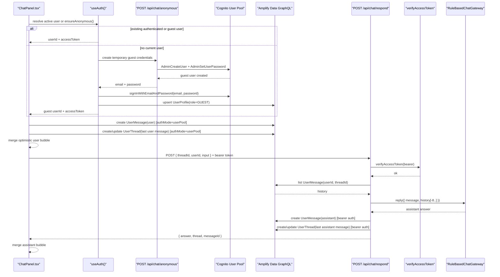
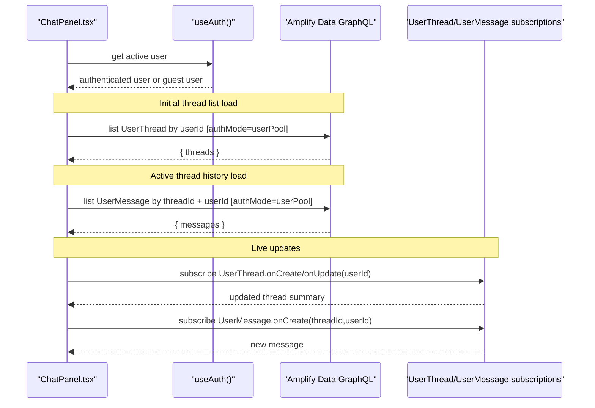
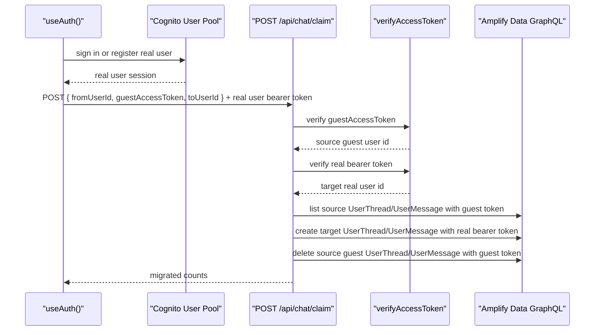

# Chat Sequences

## ChatPanel.sendMessage

```mermaid
sequenceDiagram
  participant ChatPanel as "ChatPanel.tsx"
  participant Auth as "useAuth()"
  participant GuestAPI as "POST /api/chat/anonymous"
  participant Cognito as "Cognito User Pool"
  participant AppSyncGraphQL as "Amplify Data GraphQL"
  participant RespondAPI as "POST /api/chat/respond"
  participant VerifyToken as "verifyAccessToken"
  participant ChatGateway as "RuleBasedChatGateway"

  ChatPanel->>Auth: resolve active user or ensureAnonymous()
  alt existing authenticated or guest user
    Auth-->>ChatPanel: userId + accessToken
  else no current user
    Auth->>GuestAPI: create temporary guest credentials
    GuestAPI->>Cognito: AdminCreateUser + AdminSetUserPassword
    Cognito-->>GuestAPI: guest user created
    GuestAPI-->>Auth: email + password
    Auth->>Cognito: signInWithEmailAndPassword(email, password)
    Auth->>AppSyncGraphQL: upsert UserProfile(role=GUEST)
    Auth-->>ChatPanel: guest userId + accessToken
  end

  ChatPanel->>AppSyncGraphQL: create UserMessage(user) [authMode=userPool]
  ChatPanel->>AppSyncGraphQL: create/update UserThread(last user message) [authMode=userPool]
  ChatPanel-->>ChatPanel: merge optimistic user bubble
  ChatPanel->>RespondAPI: POST { threadId, userId, input } + bearer token
  RespondAPI->>VerifyToken: verifyAccessToken(bearer)
  VerifyToken-->>RespondAPI: ok
  RespondAPI->>AppSyncGraphQL: list UserMessage(userId, threadId)
  AppSyncGraphQL-->>RespondAPI: history
  RespondAPI->>ChatGateway: reply({ message, history[-8..] })
  ChatGateway-->>RespondAPI: assistant answer
  RespondAPI->>AppSyncGraphQL: create UserMessage(assistant) [bearer auth]
  RespondAPI->>AppSyncGraphQL: create/update UserThread(last assistant message) [bearer auth]
  RespondAPI-->>ChatPanel: { answer, thread, messageId }
  ChatPanel-->>ChatPanel: merge assistant bubble
```

## ChatPanel.loadThreadsAndMessages

```mermaid
sequenceDiagram
  participant ChatPanel as "ChatPanel.tsx"
  participant Auth as "useAuth()"
  participant AppSyncGraphQL as "Amplify Data GraphQL"
  participant AmplifySubscriptions as "UserThread/UserMessage subscriptions"

  ChatPanel->>Auth: get active user
  Auth-->>ChatPanel: authenticated user or guest user

  Note over ChatPanel,AppSyncGraphQL: Initial thread list load
  ChatPanel->>AppSyncGraphQL: list UserThread by userId [authMode=userPool]
  AppSyncGraphQL-->>ChatPanel: { threads }

  Note over ChatPanel,AppSyncGraphQL: Active thread history load
  ChatPanel->>AppSyncGraphQL: list UserMessage by threadId + userId [authMode=userPool]
  AppSyncGraphQL-->>ChatPanel: { messages }

  Note over ChatPanel,AmplifySubscriptions: Live updates
  ChatPanel->>AmplifySubscriptions: subscribe UserThread.onCreate/onUpdate(userId)
  AmplifySubscriptions-->>ChatPanel: updated thread summary
  ChatPanel->>AmplifySubscriptions: subscribe UserMessage.onCreate(threadId,userId)
  AmplifySubscriptions-->>ChatPanel: new message
```

## Guest Chat Claim On Login

```mermaid
sequenceDiagram
  participant Auth as "useAuth()"
  participant Cognito as "Cognito User Pool"
  participant ClaimAPI as "POST /api/chat/claim"
  participant VerifyToken as "verifyAccessToken"
  participant AppSyncGraphQL as "Amplify Data GraphQL"

  Auth->>Cognito: sign in or register real user
  Cognito-->>Auth: real user session
  Auth->>ClaimAPI: POST { fromUserId, guestAccessToken, toUserId } + real user bearer token
  ClaimAPI->>VerifyToken: verify guestAccessToken
  VerifyToken-->>ClaimAPI: source guest user id
  ClaimAPI->>VerifyToken: verify real bearer token
  VerifyToken-->>ClaimAPI: target real user id
  ClaimAPI->>AppSyncGraphQL: list source UserThread/UserMessage with guest token
  ClaimAPI->>AppSyncGraphQL: create target UserThread/UserMessage with real bearer token
  ClaimAPI->>AppSyncGraphQL: delete source guest UserThread/UserMessage with guest token
  ClaimAPI-->>Auth: migrated counts
```
