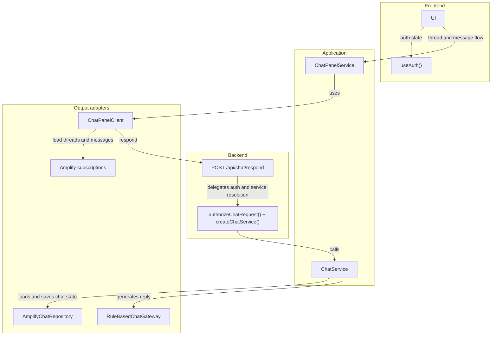

# Chat Flowchart

```mermaid
flowchart TB
  subgraph FE["Frontend"]
    UI["UI"]
    Auth["useAuth()"]
  end

  subgraph BE["Backend"]
    RespondAPI["POST /api/chat/respond"]
    ChatShared["authorizeChatRequest() + createChatService()"]
  end

  subgraph APP["Application"]
    ChatPanelService["ChatPanelService"]
    ChatService["ChatService"]
  end

  subgraph OUT["Output adapters"]
    ChatPanelClient["ChatPanelClient"]
    AmplifyChatRepository["AmplifyChatRepository"]
    ChatGateway["RuleBasedChatGateway"]
    AmplifySubscriptions["Amplify subscriptions"]
  end

  UI -->|auth state| Auth
  UI -->|thread and message flow| ChatPanelService

  ChatPanelService -->|uses| ChatPanelClient
  ChatPanelClient -->|load threads and messages| AmplifySubscriptions
  ChatPanelClient -->|respond| RespondAPI

  RespondAPI -->|delegates auth and service resolution| ChatShared
  ChatShared -->|calls| ChatService

  ChatService -->|loads and saves chat state| AmplifyChatRepository
  ChatService -->|generates reply| ChatGateway
```
