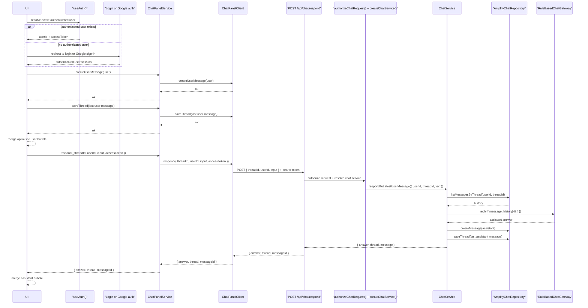
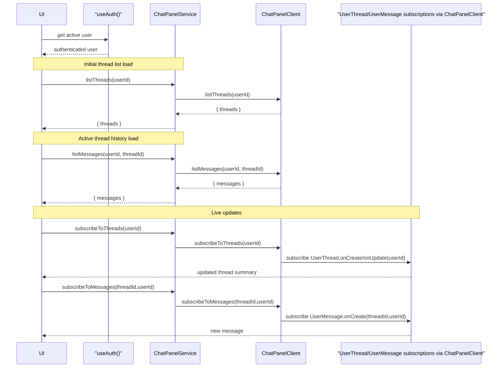

# Chat Sequences

## 1. Chat Message Send

```mermaid
sequenceDiagram
  participant UI
  participant Auth as "useAuth()"
  participant Login as "Login or Google auth"
  participant ChatPanelService
  participant ChatPanelClient
  participant RespondAPI as "POST /api/chat/respond"
  participant SharedAdapter as "authorizeChatRequest() + createChatService()"
  participant ChatService
  participant ChatRepository as "AmplifyChatRepository"
  participant ChatGateway as "RuleBasedChatGateway"

  UI->>Auth: resolve active authenticated user
  alt authenticated user exists
    Auth-->>UI: userId + accessToken
  else no authenticated user
    UI->>Login: redirect to login or Google sign-in
    Login-->>UI: authenticated user session
  end

  UI->>ChatPanelService: createUserMessage(user)
  ChatPanelService->>ChatPanelClient: createUserMessage(user)
  ChatPanelClient-->>ChatPanelService: ok
  ChatPanelService-->>UI: ok
  UI->>ChatPanelService: saveThread(last user message)
  ChatPanelService->>ChatPanelClient: saveThread(last user message)
  ChatPanelClient-->>ChatPanelService: ok
  ChatPanelService-->>UI: ok
  UI-->>UI: merge optimistic user bubble
  UI->>ChatPanelService: respond({ threadId, userId, input, accessToken })
  ChatPanelService->>ChatPanelClient: respond({ threadId, userId, input, accessToken })
  ChatPanelClient->>RespondAPI: POST { threadId, userId, input } + bearer token
  RespondAPI->>SharedAdapter: authorize request + resolve chat service
  SharedAdapter->>ChatService: respondToLatestUserMessage({ userId, threadId, text })
  ChatService->>ChatRepository: listMessagesByThread(userId, threadId)
  ChatRepository-->>ChatService: history
  ChatService->>ChatGateway: reply({ message, history[-8..] })
  ChatGateway-->>ChatService: assistant answer
  ChatService->>ChatRepository: createMessage(assistant)
  ChatService->>ChatRepository: saveThread(last assistant message)
  ChatService-->>RespondAPI: { answer, thread, message }
  RespondAPI-->>ChatPanelClient: { answer, thread, messageId }
  ChatPanelClient-->>ChatPanelService: { answer, thread, messageId }
  ChatPanelService-->>UI: { answer, thread, messageId }
  UI-->>UI: merge assistant bubble
```

## 2. Chat Load

```mermaid
sequenceDiagram
  participant UI
  participant Auth as "useAuth()"
  participant ChatPanelService
  participant ChatPanelClient
  participant AmplifySubscriptions as "UserThread/UserMessage subscriptions via ChatPanelClient"

  UI->>Auth: get active user
  Auth-->>UI: authenticated user

  Note over UI,ChatPanelService: Initial thread list load
  UI->>ChatPanelService: listThreads(userId)
  ChatPanelService->>ChatPanelClient: listThreads(userId)
  ChatPanelClient-->>ChatPanelService: { threads }
  ChatPanelService-->>UI: { threads }

  Note over UI,ChatPanelService: Active thread history load
  UI->>ChatPanelService: listMessages(userId, threadId)
  ChatPanelService->>ChatPanelClient: listMessages(userId, threadId)
  ChatPanelClient-->>ChatPanelService: { messages }
  ChatPanelService-->>UI: { messages }

  Note over UI,AmplifySubscriptions: Live updates
  UI->>ChatPanelService: subscribeToThreads(userId)
  ChatPanelService->>ChatPanelClient: subscribeToThreads(userId)
  ChatPanelClient->>AmplifySubscriptions: subscribe UserThread.onCreate/onUpdate(userId)
  AmplifySubscriptions-->>UI: updated thread summary
  UI->>ChatPanelService: subscribeToMessages(threadId,userId)
  ChatPanelService->>ChatPanelClient: subscribeToMessages(threadId,userId)
  ChatPanelClient->>AmplifySubscriptions: subscribe UserMessage.onCreate(threadId,userId)
  AmplifySubscriptions-->>UI: new message
```
