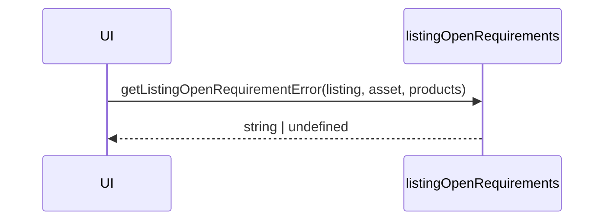
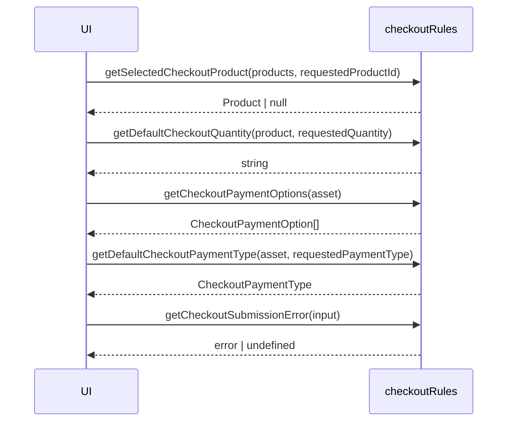
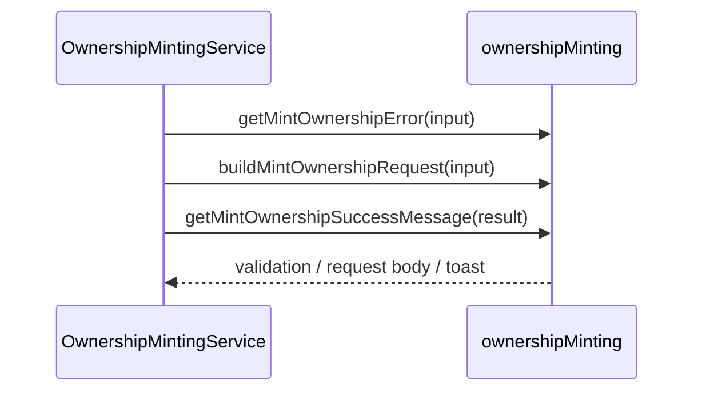
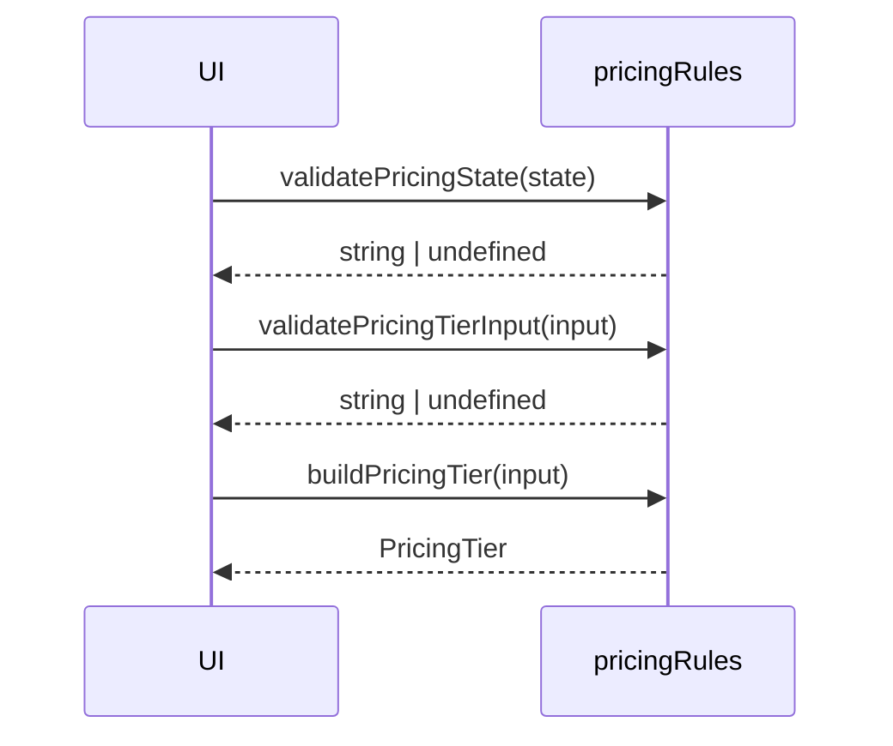
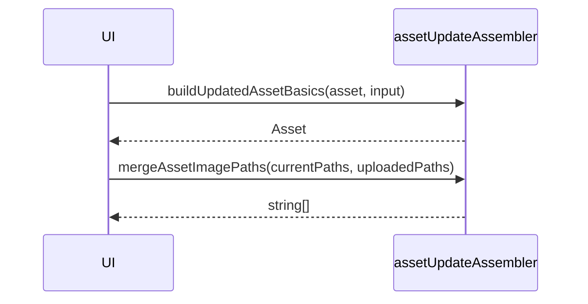

# Shared Rules And Helpers Sequences

## listingOpenRequirements.getListingOpenRequirementError

```mermaid
sequenceDiagram
  participant UI
  participant listingOpenRequirements

  UI->>listingOpenRequirements: getListingOpenRequirementError(listing, asset, products)
  listingOpenRequirements-->>UI: string | undefined
```

## checkoutRules

```mermaid
sequenceDiagram
  participant UI
  participant checkoutRules

  UI->>checkoutRules: getSelectedCheckoutProduct(products, requestedProductId)
  checkoutRules-->>UI: Product | null
  UI->>checkoutRules: getDefaultCheckoutQuantity(product, requestedQuantity)
  checkoutRules-->>UI: string
  UI->>checkoutRules: getCheckoutPaymentOptions(asset)
  checkoutRules-->>UI: CheckoutPaymentOption[]
  UI->>checkoutRules: getDefaultCheckoutPaymentType(asset, requestedPaymentType)
  checkoutRules-->>UI: CheckoutPaymentType
  UI->>checkoutRules: getCheckoutSubmissionError(input)
  checkoutRules-->>UI: error | undefined
```

## ownershipMinting

```mermaid
sequenceDiagram
  participant OwnershipMintingService
  participant ownershipMinting

  OwnershipMintingService->>ownershipMinting: getMintOwnershipError(input)
  OwnershipMintingService->>ownershipMinting: buildMintOwnershipRequest(input)
  OwnershipMintingService->>ownershipMinting: getMintOwnershipSuccessMessage(result)
  ownershipMinting-->>OwnershipMintingService: validation / request body / toast
```

## pricingRules

```mermaid
sequenceDiagram
  participant UI
  participant pricingRules

  UI->>pricingRules: validatePricingState(state)
  pricingRules-->>UI: string | undefined
  UI->>pricingRules: validatePricingTierInput(input)
  pricingRules-->>UI: string | undefined
  UI->>pricingRules: buildPricingTier(input)
  pricingRules-->>UI: PricingTier
```

## assetUpdateAssembler

```mermaid
sequenceDiagram
  participant UI
  participant assetUpdateAssembler

  UI->>assetUpdateAssembler: buildUpdatedAssetBasics(asset, input)
  assetUpdateAssembler-->>UI: Asset
  UI->>assetUpdateAssembler: mergeAssetImagePaths(currentPaths, uploadedPaths)
  assetUpdateAssembler-->>UI: string[]
```
