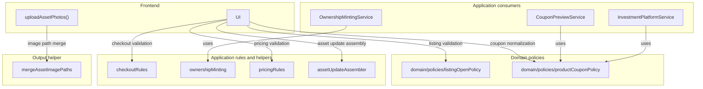

# Shared Rules And Helpers Flowchart

```mermaid
flowchart TB
  subgraph FE["Frontend"]
    UI["UI"]
    AssetUploadFacade["uploadAssetPhotos()"]
  end

  subgraph APP["Application consumers"]
    OwnershipMintingService["OwnershipMintingService"]
    CouponPreviewService["CouponPreviewService"]
    InvestmentPlatformService["InvestmentPlatformService"]
  end

  subgraph DOMAIN["Domain policies"]
    ListingOpenPolicy["domain/policies/listingOpenPolicy"]
    ProductCouponPolicy["domain/policies/productCouponPolicy"]
  end

  subgraph RULES["Application rules and helpers"]
    CheckoutRules["checkoutRules"]
    OwnershipMintingRules["ownershipMinting"]
    PricingRules["pricingRules"]
    AssetUpdateAssembler["assetUpdateAssembler"]
  end

  subgraph OUT["Output helper"]
    MergeAssetImagePaths["mergeAssetImagePaths"]
  end

  UI -->|listing validation| ListingOpenPolicy
  UI -->|coupon normalization| ProductCouponPolicy
  UI -->|checkout validation| CheckoutRules
  UI -->|pricing validation| PricingRules
  UI -->|asset update assembly| AssetUpdateAssembler

  OwnershipMintingService -->|uses| OwnershipMintingRules
  CouponPreviewService -->|uses| ProductCouponPolicy
  InvestmentPlatformService -->|uses| ProductCouponPolicy
  AssetUploadFacade -->|image path merge| MergeAssetImagePaths
```
