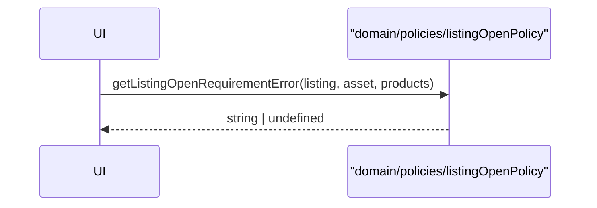
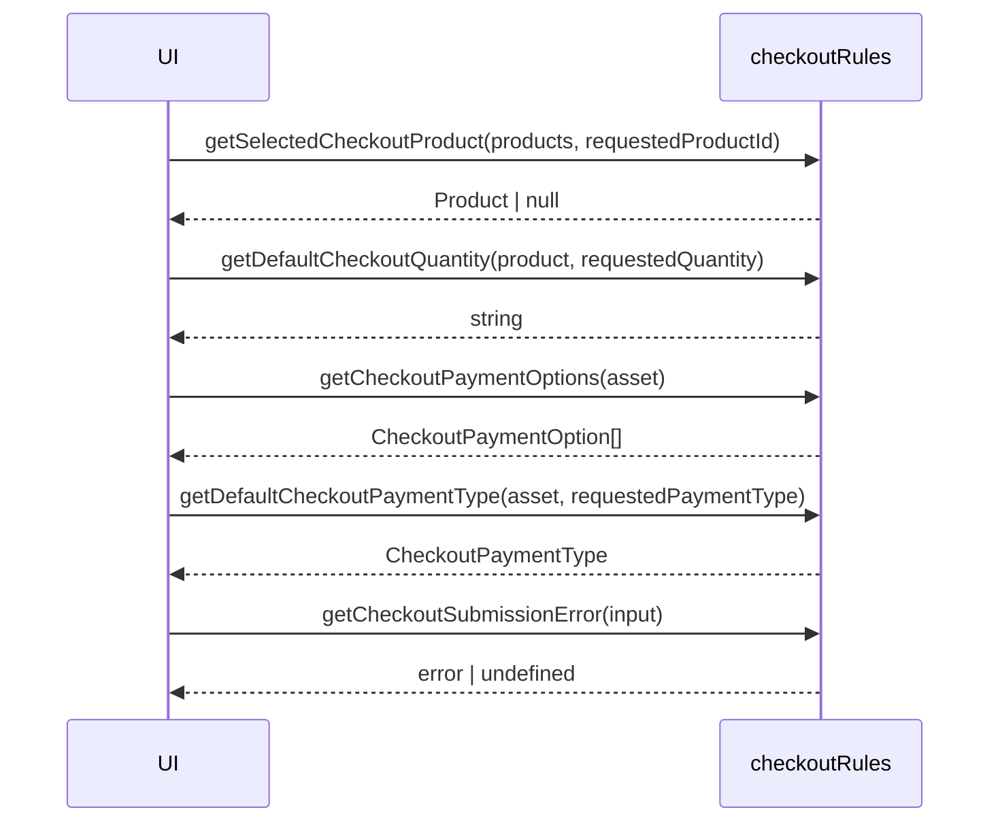
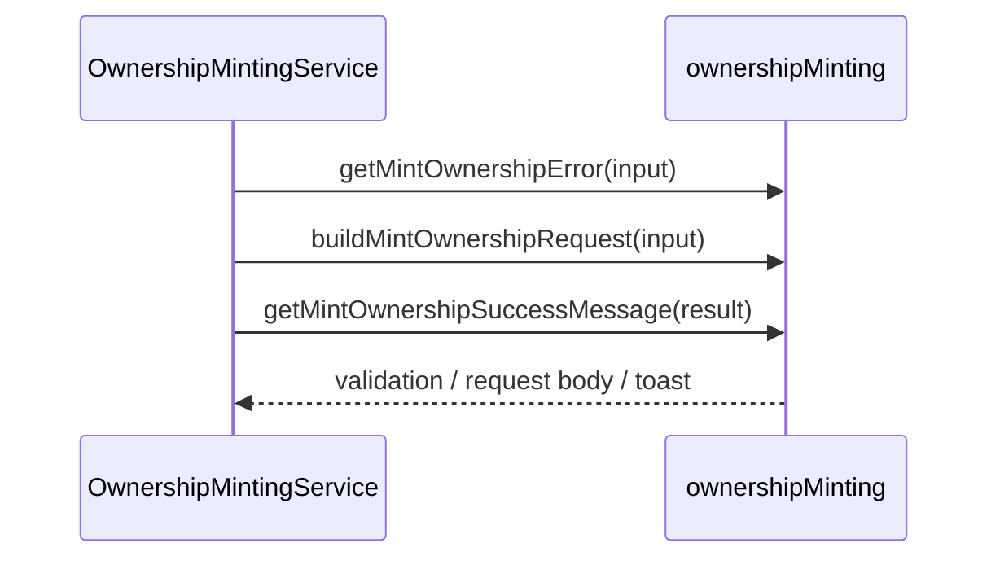
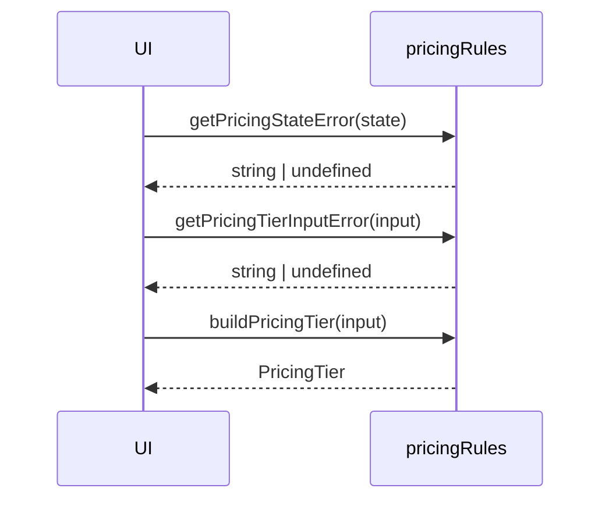
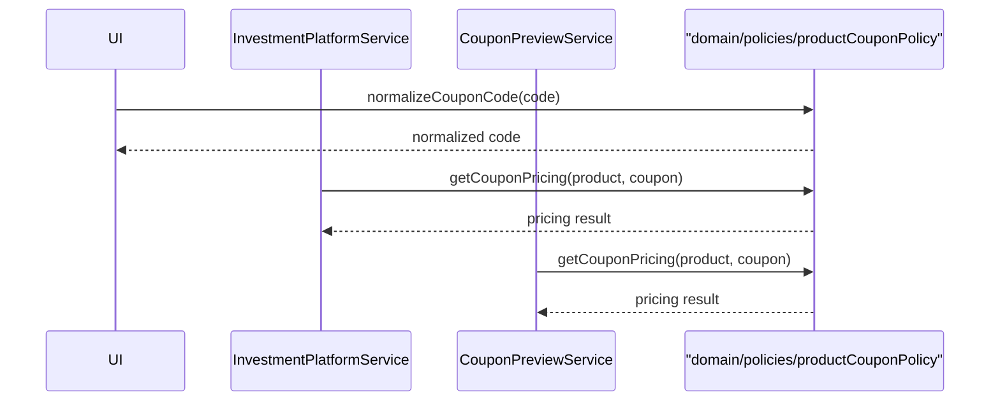
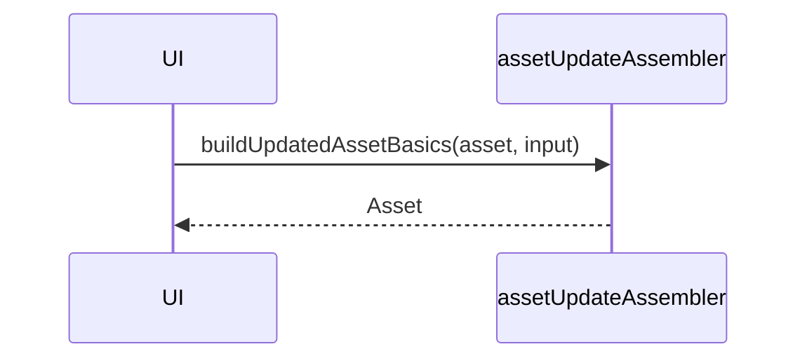
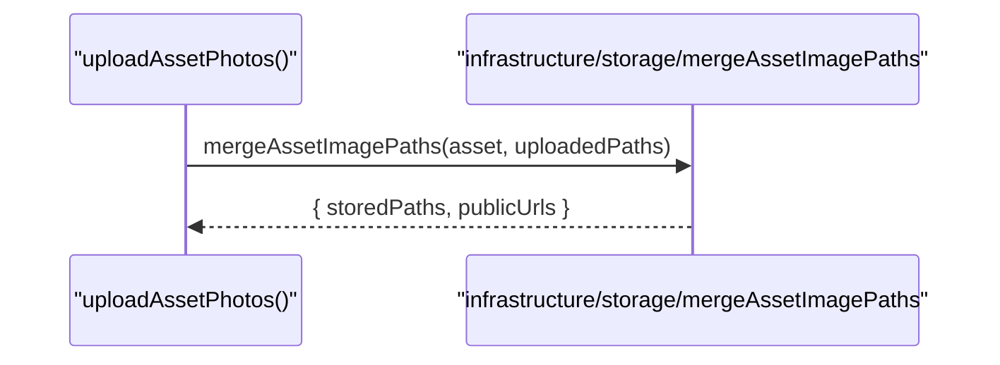

# Shared Rules And Helpers Sequences

## 1. Listing Open Check

## 2. Checkout Rules

## 3. Ownership Mint Rules

## 4. Pricing Rules

## 5. Product Coupon Policy

## 6. Asset Update Assembly

## 7. Asset Image Merge

