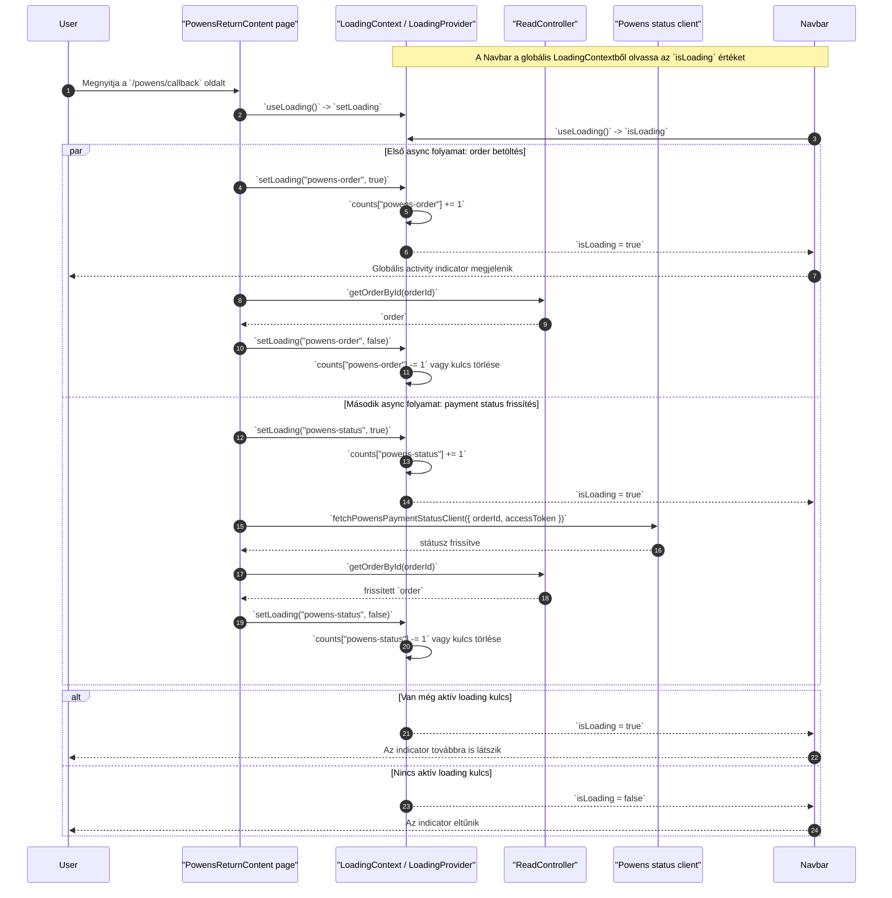

# Global Activity Indicator

Példa oldal: `app/powens/callback/page.tsx`

Ez a flow azt mutatja meg, hogyan működik a globális activity indicator a `LoadingContext` segítségével:

1. A `RootLayout` a teljes appot `LoadingProvider`-rel csomagolja körbe.
2. A `Navbar` a `useLoading()` hookból olvassa az `isLoading` értéket.
3. A `PowensReturnContent` a `useLoading()` hookból meghívja a `setLoading(key, true|false)` függvényt.
4. A `LoadingProvider` a `counts` mapben kulcsonként számlálja az aktív műveleteket.
5. Ha bármelyik számláló nagyobb mint 0, akkor `isLoading = true`, és a `Navbar` megjeleníti a globális indikátort.
6. Amikor minden futó művelet visszaáll `false`-ra, `isLoading = false`, és az indikátor eltűnik.

Kapcsolódó fájlok:

- `app/layout.tsx`
- `contexts/LoadingContext.tsx`
- `components/navigation/Navbar.tsx`
- `app/powens/callback/page.tsx`
